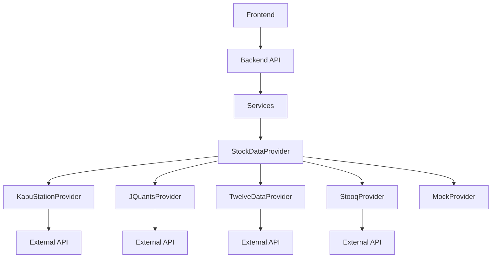
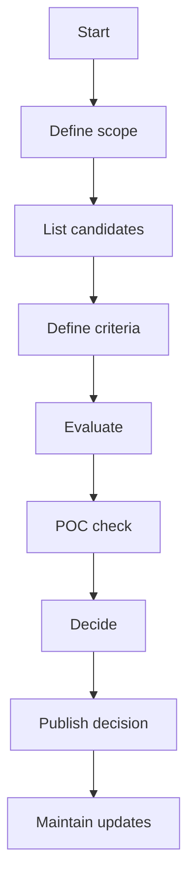

# Design Document: api-selection

## Overview
本機能は、Kabu Trade が利用する外部株式データAPIの候補を整理し、評価軸に基づいて比較し、採用APIと導入方針をチームで合意可能な形で決定するための設計です。  
既存のバックエンドは `StockDataProvider` を中心とした外部データ取得の差し替え構造を持つため、選定結果は「単発の比較」ではなく **将来の差し替え・併用・フォールバック**を前提に、契約（contract）と運用要件まで含めて整理します。

### Goals
- 候補APIを **同一基準**で評価し、採用/不採用を説明可能にする
- 初期段階は **無料で気軽に登録して利用開始できる**（`2.3`）候補を優先し、PoC可能な状態にする（ただし鮮度要件に劣後する）
- 初期段階の必須要件として **日本のプライム市場に対応**する（`1.2`）
- 初期段階の致命条件として **直近データが欠落しない**（`2.6`）ことを担保する
- 採用APIの導入方針（認証、レート制限、遅延、利用規約、運用）を設計として固定する
- 既存の `StockDataProvider` 抽象化と整合する形で、採用後の実装着手がブレないようにする

### Non-Goals
- 本ドキュメント時点で、特定ベンダーを最終確定すること（決定は評価結果で行う）
- 既存UI/APIの機能拡張（例: 新エンドポイント追加）を同時に実装すること
- 価格や規約の最新値を本書に埋め込むこと（根拠は `research.md` に残し、更新運用で追従）

## Architecture

### Existing Architecture Analysis
- 既存の外部データ取得は `StockDataProvider`（抽象）で統一され、`KabuStationProvider` と `MockProvider` が実装済み。
- Kabu Trade の steering では「外部データ取得の差し替え」を前提としているため、選定結果は **Provider の追加/切替**として具体化できる必要がある。

### Architecture Pattern & Boundary Map
**Selected pattern**: Provider/Adapter + Capability Matrix（差し替え可能な外部I/O境界を保ちつつ、機能差を定量化する）  
**Steering compliance**: 外部I/Oを `external/providers` に隔離し、Service層に波及させない。モックの維持を前提にする。



**Key decisions**
- Providerは **単一のインターフェース契約**（`StockDataProvider`）を守る。
- APIごとの機能差（例: リアルタイム不可、財務データなし）を、評価時点で **Capability と制約**として明文化し、採用可否・併用可否を判断する。
- **ゲート条件**:
  - `1.2`（プライム市場対応）
  - `2.6`（データ鮮度の最低要件）
  - `2.3`（無料で開始できPoC可能）は優先条件だが、`2.6` を満たせない場合は除外（`3.4` のフォールバック案が成立する場合のみ「併用前提候補」として残す）
- **調整の扱い**: コーポレートアクション（分割/併合/配当等）による調整済み/未調整の方針を評価表に必ず記録し、UI/説明への反映（`4.4`）まで含めて採用判断する。

### Technology Stack

| Layer | Choice / Version | Role in Feature | Notes |
|-------|------------------|-----------------|-------|
| Backend / Services | Python + FastAPI | 既存Provider構造の拡張 | 新規依存は最小（既存 httpx/aiohttp を利用） |
| Data / Storage | PostgreSQL + Redis | データ保持/キャッシュ | レート制限・遅延対策としてキャッシュ方針を設計に含める |
| Infrastructure | Docker Compose | 検証環境の再現 | PoCはローカルで再現可能にする |

## System Flows

> 本機能は「選定プロセス」中心のため、意思決定フローを簡潔に示す。



## Requirements Traceability

| Requirement | Summary | Components | Interfaces | Flows |
|-------------|---------|------------|------------|-------|
| 1.1-1.5 | 候補とスコープの整理（直近欠落リスク含む） | CandidateMatrix, RiskRegister | Doc, Data | Flowchart |
| 2.1-2.7 | 評価軸/合否/根拠（鮮度/調整含む） | CandidateMatrix, EvidenceLog | Data | Flowchart |
| 3.1-3.4 | PoC/成立性/制約（フォールバック含む） | PocHarness, ProviderCapability, FallbackPlan | Service | Flowchart |
| 4.1-4.4 | 決定/成果物/リスク（初心者向け明示事項含む） | DecisionRecord, RiskRegister, UserDisclosureNotes | Doc | Flowchart |
| 5.1-5.3 | 更新運用（鮮度変化の再評価含む） | ChangeMonitorPolicy | Doc | Flowchart |

## Components and Interfaces

| Component | Domain/Layer | Intent | Req Coverage | Key Dependencies (P0/P1) | Contracts |
|----------|--------------|--------|--------------|--------------------------|----------|
| CandidateMatrix | Docs/Data | 候補APIの比較表（評価軸/合否/根拠） | 1.2, 1.3, 1.5, 2.1-2.7, 4.1, 4.4 | J-Quants docs (P1), kabu docs (P1) | State |
| DecisionRecord | Docs | 採用/不採用理由と導入方針の決定記録 | 4.1-4.3 | CandidateMatrix (P0) | State |
| EvidenceLog | Docs/Data | 参照根拠（版/日付/URL/問い合わせ） | 2.5 | CandidateMatrix (P0) | State |
| ProviderCapability | Backend/Services | Providerが満たす機能/制約（鮮度/調整含む）の表現 | 2.6, 2.7, 3.2, 3.3 | StockDataProvider (P0) | Service, State |
| PocHarness | Backend/Services | 疎通検証（最小リクエスト）と結果記録 | 3.1 | Provider adapter (P0) | Service |
| FallbackPlan | Docs | 無料開始と鮮度のトレードオフ時の併用/段階移行案 | 3.4, 1.5 | CandidateMatrix (P0) | State |
| UserDisclosureNotes | Docs | 初心者が誤解しやすい制約の明示事項リスト | 4.4 | DecisionRecord (P0) | State |

### Docs

#### CandidateMatrix
| Field | Detail |
|-------|--------|
| Intent | 候補APIを評価軸で比較し、合否と根拠を残す |
| Requirements | 1.2, 1.3, 1.5, 2.1, 2.2, 2.3, 2.5, 2.6, 2.7, 4.1, 4.4 |

**Responsibilities & Constraints**
- 候補ごとに「提供元/名称、対応データ、認証、規約要点、料金要点、遅延、レート制限」を最低限保持する
- 初期段階のゲート条件（プライム対応 `1.2`、無料開始 `2.3`）を満たすかどうかを明示する
- 直近欠落/遅延など「鮮度」制約を必ず記録し、最低要件（`2.6`）に対する合否を明示する
- 調整済み/未調整（`2.7`）の方針と、UI/説明に反映すべき注意点（`4.4`）を紐づける
- 機密情報（APIキー等）は本文に含めない（4.3）

**Contracts**: Service [ ] / API [ ] / Event [ ] / Batch [ ] / State [x]

#### DecisionRecord
| Field | Detail |
|-------|--------|
| Intent | 採用APIと導入方針を合意可能な形で固定する |
| Requirements | 4.1, 4.2, 4.3 |

**Contracts**: Service [ ] / API [ ] / Event [ ] / Batch [ ] / State [x]

### Backend / Services

#### ProviderCapability
| Field | Detail |
|-------|--------|
| Intent | Providerの機能差を明示し、併用/スコープ変更判断を支える |
| Requirements | 3.2, 3.3 |

**Contracts**: Service [x] / API [ ] / Event [ ] / Batch [ ] / State [x]

##### Service Interface
```typescript
interface ProviderCapabilityService {
  getCapabilities(providerName: string): Result<ProviderCapabilities, CapabilityError>;
}
```
- Preconditions: providerName は登録済み識別子である
- Postconditions: capability はデータ種別/遅延/制約を含む
- Invariants: capability は機密情報を含まない

#### PocHarness
| Field | Detail |
|-------|--------|
| Intent | 候補APIの疎通と主要制約（認証/レート/遅延）を最小コストで検証する |
| Requirements | 3.1 |

**Contracts**: Service [x] / API [ ] / Event [ ] / Batch [x] / State [ ]

## Data Models

### Domain Model
- **ApiCandidate**: 候補API（名称、提供元、カテゴリ）
- **Criterion**: 評価軸（判定方法、合否条件）
- **EvaluationResult**: 候補×評価軸の結果（合否、スコア、根拠参照）
- **Decision**: 採用/不採用と理由、導入方針

### Data Contracts & Integration
- 外部APIの詳細仕様・制約は `research.md` に一次情報を残し、`design.md` には採用方針としての結論（例: 遅延許容、キャッシュ方針、規約上の禁止事項）を記述する。

## Error Handling

### Error Strategy
- **選定プロセス**: 根拠不明・規約不明は「不採用」ではなく「保留/要確認」として扱い、追加調査を促す（2.5, 2.4）
- **鮮度**: 鮮度の根拠が不明確、または直近欠落が疑われる場合は「保留/不採用」とし、`3.4` のフォールバック案が成立する場合のみ「併用前提候補」として残す（2.6, 1.5, 3.4）
- **PoC**: 認証失敗/レート制限/タイムアウトは分類して記録し、再試行条件と回避策を設計に残す（3.1）

## Testing Strategy

- Unit Tests:
  - ProviderCapability の機密情報非保持（4.3）
  - 評価軸（Criterion）の合否判定ロジック（2.2）
  - 鮮度ゲート（2.6）とフォールバック必須条件（3.4）の判定
- Integration Tests:
  - PoCの疎通結果がEvidenceLogに記録される（3.1, 2.5）
- E2E/UI Tests:
  - （該当なし。UI追加は非スコープ）

## Security Considerations
- APIキー/トークン/契約情報などの機密は、設計・ドキュメントに埋め込まない（4.3）
- 利用規約/再配布可否の確認は必須（2.3）

## Supporting References
- 一次情報リンクや比較の素材は `research.md` を参照（結論は本書に要約済み）

