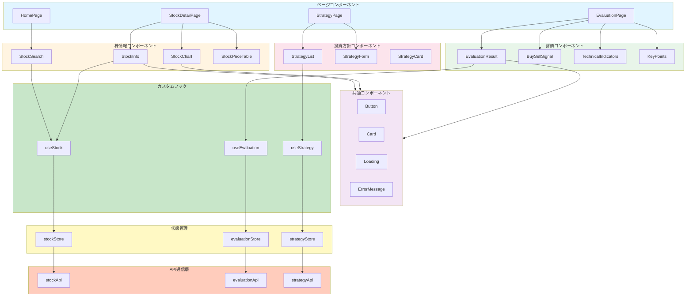
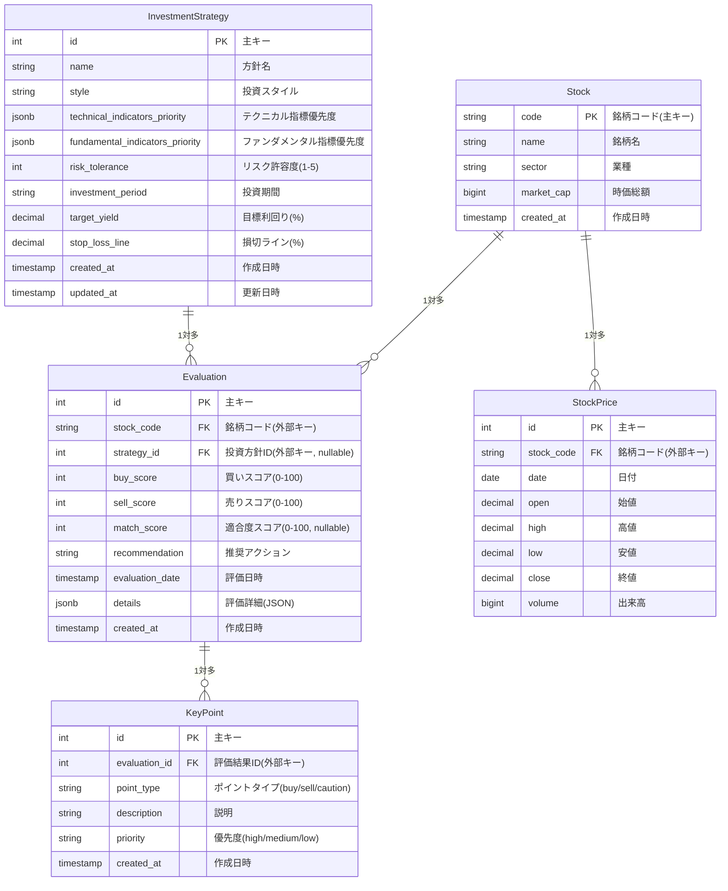
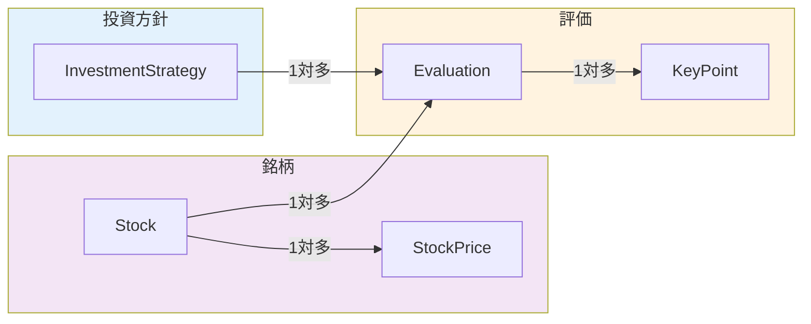
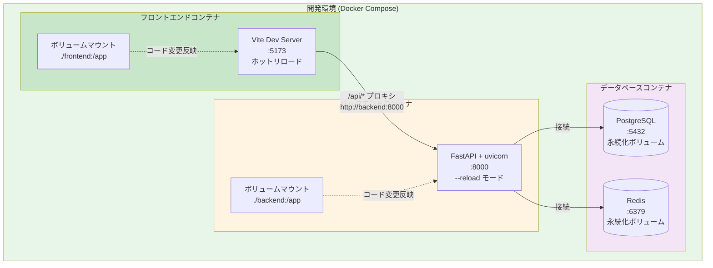
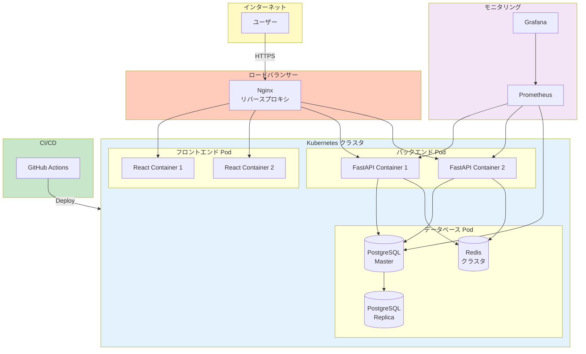
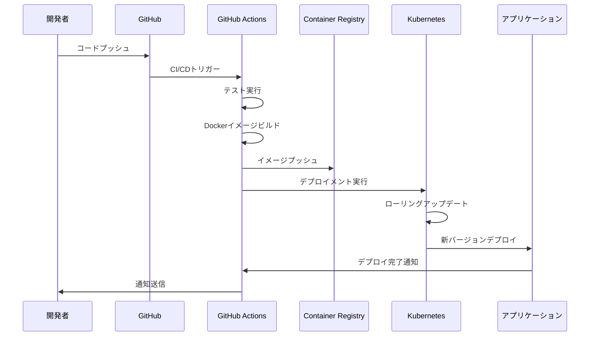

# システムアーキテクチャ詳細設計書

## 1. アーキテクチャパターン

### 1.1 採用パターン
- **レイヤードアーキテクチャ**: 関心の分離と保守性の向上
- **リポジトリパターン**: データアクセスの抽象化
- **サービスレイヤーパターン**: ビジネスロジックの集約
- **依存性注入**: テスタビリティと柔軟性の向上

### 1.2 設計原則
- **単一責任の原則**: 各コンポーネントは1つの責務のみを持つ
- **依存性逆転の原則**: 抽象に依存し、具象に依存しない
- **開放閉鎖の原則**: 拡張に開き、修正に閉じる
- **DRY原則**: コードの重複を避ける

## 2. バックエンド詳細設計

### 2.1 API層（FastAPI）

#### 2.1.1 ルーティング構造

```mermaid
graph TD
    subgraph API["/api/v1"]
        subgraph Stocks["/stocks"]
            S1[GET /<br/>銘柄一覧取得]
            S2[GET /{code}<br/>銘柄情報取得]
            S3[GET /{code}/prices<br/>株価データ取得]
            S4[GET /{code}/financials<br/>財務情報取得]
        end
        
        subgraph Evaluations["/evaluations"]
            E1[POST /<br/>評価実行]
            E2[GET /<br/>評価履歴一覧]
            E3[GET /{id}<br/>評価結果取得]
            E4[POST /strategy<br/>投資方針に基づく評価]
            E5[GET /strategy/{id}/keypoints<br/>見極めポイント取得]
        end
        
        subgraph Strategies["/strategies"]
            St1[GET /<br/>投資方針一覧]
            St2[POST /<br/>投資方針登録]
            St3[GET /{id}<br/>投資方針詳細]
            St4[PUT /{id}<br/>投資方針更新]
            St5[DELETE /{id}<br/>投資方針削除]
        end
    end
    
    style Stocks fill:#e3f2fd
    style Evaluations fill:#fff3e0
    style Strategies fill:#f3e5f5
```

#### 2.1.1.1 APIエンドポイント一覧

```
/api/v1/
├── stocks/
│   ├── GET    /                    # 銘柄一覧取得
│   ├── GET    /{code}              # 銘柄情報取得
│   ├── GET    /{code}/prices       # 株価データ取得
│   └── GET    /{code}/financials   # 財務情報取得
├── evaluations/
│   ├── POST   /                    # 評価実行
│   ├── GET    /                    # 評価履歴一覧
│   ├── GET    /{id}                # 評価結果取得
│   ├── POST   /strategy            # 投資方針に基づく評価
│   └── GET    /strategy/{id}/keypoints  # 見極めポイント取得
└── strategies/
    ├── GET    /                    # 投資方針一覧
    ├── POST   /                    # 投資方針登録
    ├── GET    /{id}                # 投資方針詳細
    ├── PUT    /{id}                # 投資方針更新
    └── DELETE /{id}                # 投資方針削除
```

#### 2.1.2 リクエスト/レスポンス例

**銘柄情報取得**
```http
GET /api/v1/stocks/7203
```

```json
{
  "code": "7203",
  "name": "トヨタ自動車",
  "sector": "自動車",
  "market_cap": 35000000000000,
  "current_price": 2500.0,
  "per": 12.5,
  "pbr": 1.2
}
```

**評価実行**
```http
POST /api/v1/evaluations
Content-Type: application/json

{
  "stock_code": "7203",
  "period": "1y"
}
```

```json
{
  "id": 123,
  "stock_code": "7203",
  "buy_score": 75,
  "sell_score": 25,
  "buy_recommendation": "推奨",
  "sell_recommendation": "様子見",
  "technical_indicators": {
    "rsi": 45.2,
    "macd": 12.5,
    "moving_average_50": 2450.0,
    "moving_average_200": 2400.0
  },
  "fundamental_metrics": {
    "per": 12.5,
    "pbr": 1.2,
    "roe": 8.5
  },
  "evaluation_date": "2024-01-15T10:30:00Z"
}
```

### 2.2 サービス層

#### 2.2.1 StockService 詳細設計

```python
class StockService:
    def __init__(
        self,
        stock_repo: StockRepository,
        external_api: StockDataProvider,
        cache: CacheService
    ):
        self.stock_repo = stock_repo
        self.external_api = external_api
        self.cache = cache
    
    async def get_stock_info(self, code: str) -> StockInfo:
        # 1. キャッシュ確認
        cached = await self.cache.get(f"stock:{code}:info")
        if cached:
            return cached
        
        # 2. DB確認
        stock = await self.stock_repo.find_by_code(code)
        if stock and stock.is_recent():
            await self.cache.set(f"stock:{code}:info", stock.info)
            return stock.info
        
        # 3. 外部API取得
        stock_info = await self.external_api.get_stock_info(code)
        
        # 4. DB保存
        await self.stock_repo.save_or_update(stock_info)
        
        # 5. キャッシュ保存
        await self.cache.set(f"stock:{code}:info", stock_info, ttl=3600)
        
        return stock_info
```

#### 2.2.2 EvaluationService 詳細設計

```python
class EvaluationService:
    def __init__(
        self,
        stock_service: StockService,
        analysis_engine: AnalysisEngine,
        eval_repo: EvaluationRepository
    ):
        self.stock_service = stock_service
        self.analysis_engine = analysis_engine
        self.eval_repo = eval_repo
    
    async def evaluate_stock(
        self,
        code: str,
        period: str = "1y"
    ) -> EvaluationResult:
        # 1. 株情報取得
        stock_info = await self.stock_service.get_stock_info(code)
        prices = await self.stock_service.get_stock_prices(code, period)
        financials = await self.stock_service.get_financial_data(code)
        
        # 2. 分析実行
        technical = await self.analysis_engine.calculate_technical(prices)
        fundamental = await self.analysis_engine.calculate_fundamental(financials)
        
        # 3. 買い時・売り時判定
        buy_signal = await self.analysis_engine.determine_buy_signal(
            technical, fundamental
        )
        sell_signal = await self.analysis_engine.determine_sell_signal(
            technical, fundamental
        )
        
        # 4. 評価結果作成
        result = EvaluationResult(
            stock_code=code,
            buy_score=buy_signal.score,
            sell_score=sell_signal.score,
            buy_recommendation=buy_signal.recommendation,
            sell_recommendation=sell_signal.recommendation,
            technical_indicators=technical,
            fundamental_metrics=fundamental
        )
        
        # 5. 保存
        await self.eval_repo.save(result)
        
        return result
```

#### 2.2.3 AnalysisEngine 詳細設計

```python
class AnalysisEngine:
    def __init__(
        self,
        technical_calculator: TechnicalIndicatorsCalculator,
        fundamental_calculator: FundamentalAnalysisCalculator
    ):
        self.technical = technical_calculator
        self.fundamental = fundamental_calculator
    
    async def calculate_technical(
        self,
        prices: List[StockPrice]
    ) -> TechnicalIndicators:
        df = pd.DataFrame([p.dict() for p in prices])
        
        return TechnicalIndicators(
            rsi=self.technical.calculate_rsi(df, period=14),
            macd=self.technical.calculate_macd(df),
            moving_average_50=self.technical.calculate_ma(df, period=50),
            moving_average_200=self.technical.calculate_ma(df, period=200),
            bollinger_bands=self.technical.calculate_bollinger(df),
            support_resistance=self.technical.find_support_resistance(df)
        )
    
    async def determine_buy_signal(
        self,
        technical: TechnicalIndicators,
        fundamental: FundamentalMetrics
    ) -> BuySignal:
        score = 0
        reasons = []
        
        # RSI判定
        if technical.rsi < 30:
            score += 30
            reasons.append("RSIが30を下回っており、売られすぎの可能性")
        elif technical.rsi < 50:
            score += 15
            reasons.append("RSIが50未満で買い機会の可能性")
        
        # 移動平均線判定
        if technical.moving_average_50 > technical.moving_average_200:
            score += 20
            reasons.append("短期移動平均線が長期移動平均線を上回っている")
        
        # MACD判定
        if technical.macd > 0:
            score += 15
            reasons.append("MACDがプラスで上昇トレンド")
        
        # ファンダメンタル判定
        if fundamental.per < 15 and fundamental.pbr < 1.5:
            score += 20
            reasons.append("PER・PBRが適正水準で割安の可能性")
        
        recommendation = self._score_to_recommendation(score)
        
        return BuySignal(
            score=min(score, 100),
            recommendation=recommendation,
            reasons=reasons
        )
```

### 2.3 リポジトリ層

#### 2.3.1 リポジトリインターフェース

```python
class StockRepository(ABC):
    @abstractmethod
    async def find_by_code(self, code: str) -> Optional[Stock]:
        pass
    
    @abstractmethod
    async def save_or_update(self, stock: Stock) -> Stock:
        pass
    
    @abstractmethod
    async def find_prices(
        self,
        code: str,
        start_date: datetime,
        end_date: datetime
    ) -> List[StockPrice]:
        pass
```

#### 2.3.2 SQLAlchemy実装例

```python
class SQLAlchemyStockRepository(StockRepository):
    def __init__(self, session: AsyncSession):
        self.session = session
    
    async def find_by_code(self, code: str) -> Optional[Stock]:
        result = await self.session.execute(
            select(StockModel).where(StockModel.code == code)
        )
        model = result.scalar_one_or_none()
        return model.to_entity() if model else None
```

## 3. フロントエンド詳細設計

### 3.1 コンポーネント構造



### 3.1.1 ディレクトリ構造

```
src/
├── components/
│   ├── common/
│   │   ├── Button.tsx
│   │   ├── Card.tsx
│   │   ├── Loading.tsx
│   │   └── ErrorMessage.tsx
│   ├── stock/
│   │   ├── StockSearch.tsx
│   │   ├── StockInfo.tsx
│   │   ├── StockChart.tsx
│   │   └── StockPriceTable.tsx
│   ├── evaluation/
│   │   ├── EvaluationResult.tsx
│   │   ├── BuySellSignal.tsx
│   │   ├── TechnicalIndicators.tsx
│   │   └── KeyPoints.tsx
│   └── strategy/
│       ├── StrategyList.tsx
│       ├── StrategyForm.tsx
│       └── StrategyCard.tsx
├── pages/
│   ├── HomePage.tsx
│   ├── StockDetailPage.tsx
│   ├── EvaluationPage.tsx
│   └── StrategyPage.tsx
├── services/
│   ├── api/
│   │   ├── stockApi.ts
│   │   ├── evaluationApi.ts
│   │   └── strategyApi.ts
│   └── types.ts
├── store/
│   ├── stockStore.ts
│   ├── evaluationStore.ts
│   └── strategyStore.ts
└── hooks/
    ├── useStock.ts
    ├── useEvaluation.ts
    └── useStrategy.ts
```

### 3.2 状態管理（Zustand例）

```typescript
interface StockState {
  currentStock: Stock | null;
  stockPrices: StockPrice[];
  loading: boolean;
  error: string | null;
  
  fetchStock: (code: string) => Promise<void>;
  fetchPrices: (code: string, period: string) => Promise<void>;
}

export const useStockStore = create<StockState>((set) => ({
  currentStock: null,
  stockPrices: [],
  loading: false,
  error: null,
  
  fetchStock: async (code: string) => {
    set({ loading: true, error: null });
    try {
      const stock = await stockApi.getStock(code);
      set({ currentStock: stock, loading: false });
    } catch (error) {
      set({ error: error.message, loading: false });
    }
  },
  
  fetchPrices: async (code: string, period: string) => {
    set({ loading: true });
    try {
      const prices = await stockApi.getPrices(code, period);
      set({ stockPrices: prices, loading: false });
    } catch (error) {
      set({ error: error.message, loading: false });
    }
  },
}));
```

### 3.3 API通信層

```typescript
class StockApi {
  private baseUrl = '/api/v1/stocks';
  
  async getStock(code: string): Promise<Stock> {
    const response = await fetch(`${this.baseUrl}/${code}`);
    if (!response.ok) {
      throw new Error(`Failed to fetch stock: ${response.statusText}`);
    }
    return response.json();
  }
  
  async getPrices(code: string, period: string): Promise<StockPrice[]> {
    const response = await fetch(
      `${this.baseUrl}/${code}/prices?period=${period}`
    );
    if (!response.ok) {
      throw new Error(`Failed to fetch prices: ${response.statusText}`);
    }
    return response.json();
  }
}

export const stockApi = new StockApi();
```

## 4. データベース設計詳細

### 4.1 ER図



### 4.1.1 リレーションシップ詳細



### 4.2 マイグレーション戦略

- Alembicを使用したバージョン管理
- 本番環境への適用前に必ずテスト環境で検証
- ロールバックスクリプトの準備

## 5. パフォーマンス最適化

### 5.1 バックエンド最適化
- **非同期処理**: FastAPIの非同期機能を活用
- **データベースクエリ最適化**: N+1問題の回避、適切なJOIN使用
- **キャッシュ戦略**: Redisによる頻繁にアクセスされるデータのキャッシュ
- **バッチ処理**: 複数銘柄の評価をバッチで実行

### 5.2 フロントエンド最適化
- **コード分割**: React.lazyによる動的インポート
- **メモ化**: useMemo, useCallbackの適切な使用
- **仮想スクロール**: 大量データのリスト表示
- **画像最適化**: 適切なフォーマットとサイズ

## 6. セキュリティ対策

### 6.1 APIセキュリティ
- **入力検証**: Pydanticによるリクエストバリデーション
- **SQLインジェクション対策**: ORM使用による自動エスケープ
- **レート制限**: 1分あたり100リクエスト
- **CORS設定**: 許可されたオリジンのみ

### 6.2 データ保護
- **環境変数**: 機密情報の環境変数管理
- **HTTPS**: 本番環境でのHTTPS強制
- **ログ管理**: 機密情報のログ出力禁止

## 7. テスト戦略

### 7.1 バックエンドテスト
- **単体テスト**: 各サービス・リポジトリのテスト
- **統合テスト**: APIエンドポイントのテスト
- **モック**: 外部APIのモック化

### 7.2 フロントエンドテスト
- **コンポーネントテスト**: React Testing Library
- **E2Eテスト**: Playwright（将来的）

## 8. デプロイメント

### 8.1 開発環境構成

**構成の特徴:**
- すべてのサービスをDocker Composeで統一管理
- フロントエンドとバックエンドもDockerコンテナで実行
- ボリュームマウントにより、コード変更が即座に反映（ホットリロード）
- 開発環境と本番環境で同じ構成を維持可能



**起動方法:**
```bash
# すべてのサービスを起動
docker compose up --build

# バックグラウンドで起動
docker compose up -d --build

# ログ確認
docker compose logs -f

# 停止
docker compose down
```

**アクセス:**
- フロントエンド: http://localhost:5173
- バックエンドAPI: http://localhost:8000
- APIドキュメント: http://localhost:8000/docs

### 8.2 本番環境構成（将来的）



### 8.3 デプロイメントフロー



### 8.4 開発環境セットアップ
- Docker Composeによるローカル環境構築
- ホットリロード対応
- 開発用データの自動投入

### 8.5 本番環境（将来的）
- コンテナオーケストレーション: Kubernetes
- CI/CD: GitHub Actions
- モニタリング: Prometheus + Grafana
- ログ管理: ELK Stack（Elasticsearch, Logstash, Kibana）
- バックアップ: データベースの定期バックアップ

