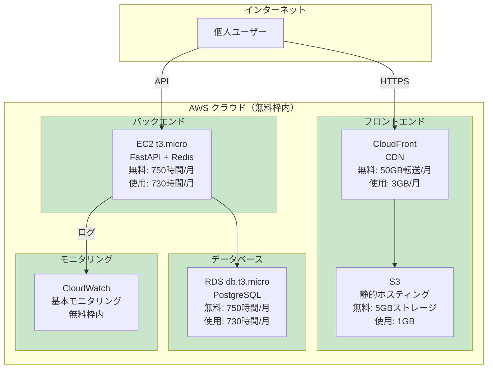
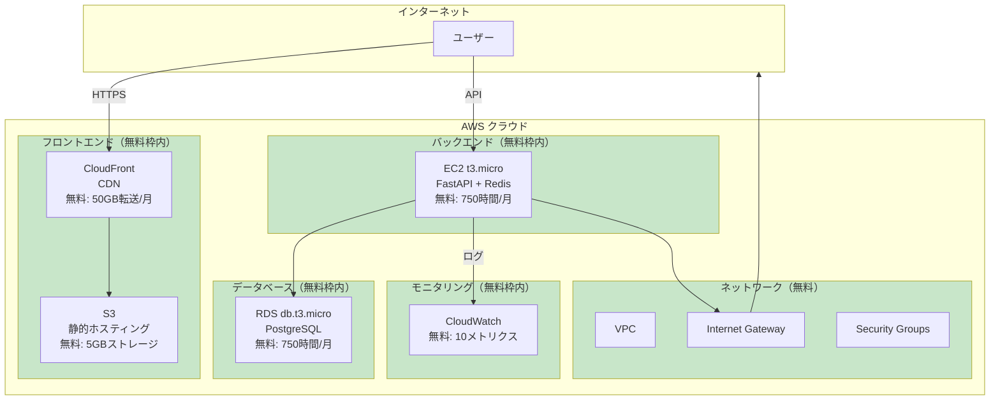
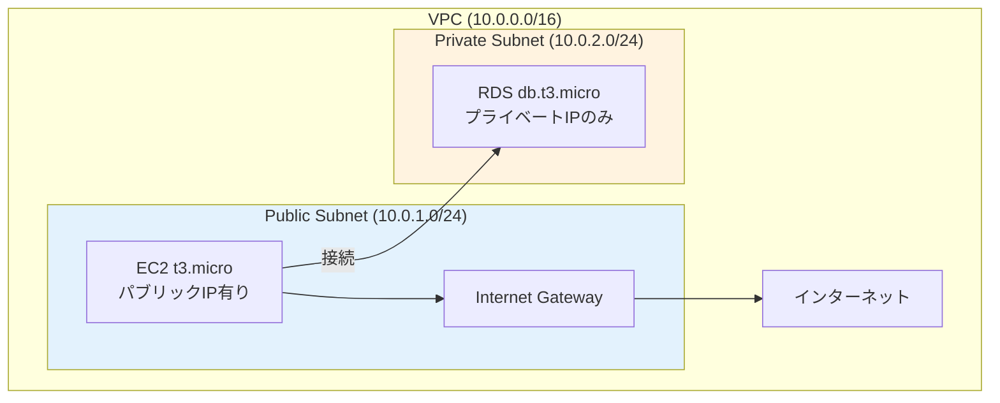
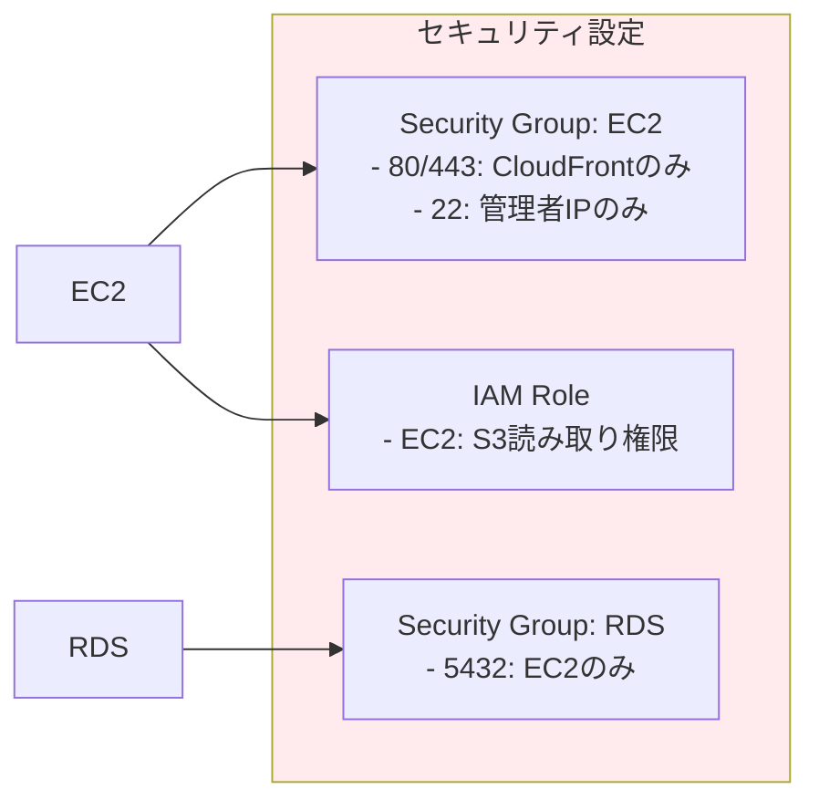
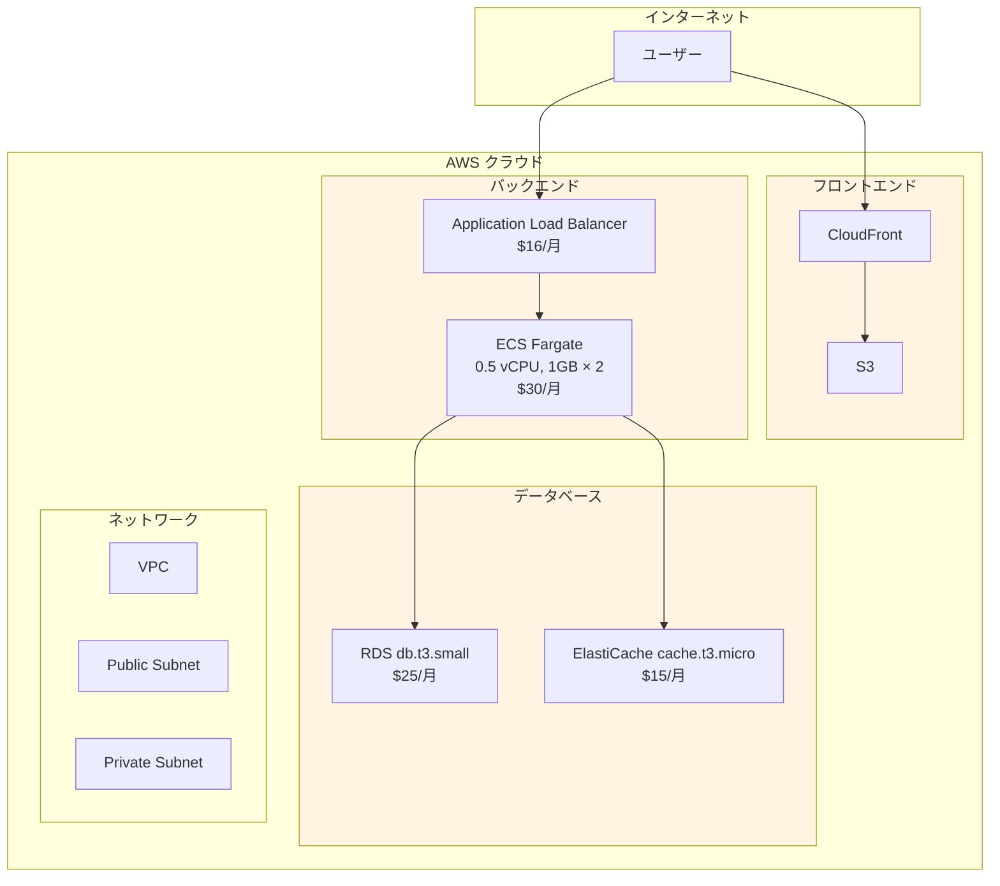
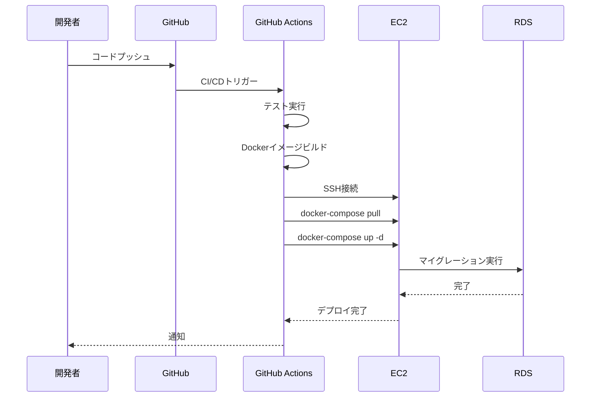
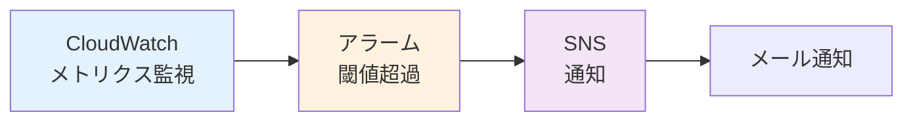

# AWS アーキテクチャ設計書

## 1. 個人利用向け構成（推奨）⭐

### 1.0 個人利用向けシステム構成

**想定:** 個人の投資効率化のための利用（ユーザー数: 1人）



**月額コスト: $0（完全無料）**

**無料枠使用率:**
- EC2: 97% - 余裕あり
- RDS: 97% - 余裕あり
- S3: 20% - 余裕あり
- CloudFront: 6% - 余裕あり

---

## 2. 無料枠内構成（複数ユーザー向け）

### 1.1 システム構成図



### 1.2 ネットワーク構成



### 1.3 セキュリティ構成



## 3. 標準構成（小規模運用）

### 2.1 システム構成図



## 4. リソース詳細

### 4.1 EC2構成（無料枠内・個人利用向け）

**個人利用の場合の推奨設定:**

**インスタンスタイプ:** t3.micro
- vCPU: 2
- メモリ: 1GB
- ネットワーク: 最大5Gbps

**構成の特徴:**
- FastAPIとRedisを同じインスタンスで実行（コスト削減）
- 個人利用なので、1インスタンスで十分
- 24時間稼働でも無料枠内（730時間/月 < 750時間/月）

**AMI:** Amazon Linux 2023 または Ubuntu 22.04 LTS

**ユーザーデータスクリプト例:**
```bash
#!/bin/bash
# DockerとDocker Composeのインストール
yum update -y
yum install -y docker
systemctl start docker
systemctl enable docker
usermod -a -G docker ec2-user

# Docker Composeのインストール
curl -L "https://github.com/docker/compose/releases/latest/download/docker-compose-$(uname -s)-$(uname -m)" -o /usr/local/bin/docker-compose
chmod +x /usr/local/bin/docker-compose

# Redisのインストール（EC2上で直接実行）
yum install -y redis
systemctl start redis
systemctl enable redis

# アプリケーションのデプロイ
# (GitHubからクローン、docker-compose up等)
```

### 4.2 EC2構成（無料枠内・複数ユーザー向け）

**インスタンスタイプ:** t3.micro
- vCPU: 2
- メモリ: 1GB
- ネットワーク: 最大5Gbps

**AMI:** Amazon Linux 2023 または Ubuntu 22.04 LTS

**ユーザーデータスクリプト例:**
```bash
#!/bin/bash
# DockerとDocker Composeのインストール
yum update -y
yum install -y docker
systemctl start docker
systemctl enable docker
usermod -a -G docker ec2-user

# Docker Composeのインストール
curl -L "https://github.com/docker/compose/releases/latest/download/docker-compose-$(uname -s)-$(uname -m)" -o /usr/local/bin/docker-compose
chmod +x /usr/local/bin/docker-compose

# アプリケーションのデプロイ
# (GitHubからクローン、docker-compose up等)
```

### 4.3 RDS構成（無料枠内・個人利用向け）

**個人利用の場合の推奨設定:**

**インスタンスタイプ:** db.t3.micro
- vCPU: 2
- メモリ: 1GB
- ストレージ: 20GB (GP3) - 個人利用なら5GB程度で十分

**エンジン:** PostgreSQL 15.x

**設定:**
- マルチAZ: 無効（無料枠内、個人利用なので不要）
- 自動バックアップ: 7日間保持（無料枠内）
- パブリックアクセス: 無効（セキュリティ）
- ストレージ自動拡張: 無効（コスト削減、個人利用なら20GBで十分）

**個人利用での想定データ量:**
- 投資方針: 10-50件（数MB）
- 評価履歴: 100-500件（10-50MB）
- 株価データ: 100-500銘柄 × 1年分（50-200MB）
- **合計: 100-500MB程度** → 20GBストレージで十分

### 4.4 RDS構成（無料枠内・複数ユーザー向け）

**インスタンスタイプ:** db.t3.micro
- vCPU: 2
- メモリ: 1GB
- ストレージ: 20GB (GP3)

**エンジン:** PostgreSQL 15.x

**設定:**
- マルチAZ: 無効（無料枠内）
- 自動バックアップ: 7日間保持
- パブリックアクセス: 無効

### 4.5 S3構成（個人利用向け）

**個人利用の場合の推奨設定:**

**バケット構成:**
- `kabu-trade-frontend`: フロントエンド静的ファイル（100-500MB）
- `kabu-trade-backups`: データバックアップ（オプション、月次）

**設定:**
- バージョニング: 無効（コスト削減）
- 静的ウェブサイトホスティング: 有効
- CloudFront OAIでアクセス制御
- ライフサイクルポリシー: 30日後にIA（Infrequent Access）へ移動

**個人利用での想定ストレージ:**
- フロントエンド: 100-500MB
- バックアップ: 500MB-1GB（月次）
- **合計: 1GB程度** → 無料枠5GB内で十分

### 4.6 S3構成（複数ユーザー向け）

**バケット構成:**
- `kabu-trade-frontend`: フロントエンド静的ファイル
- `kabu-trade-data`: データバックアップ（オプション）

**設定:**
- バージョニング: 無効（コスト削減）
- 静的ウェブサイトホスティング: 有効
- CloudFront OAIでアクセス制御

### 4.7 CloudFront構成（個人利用向け）

**個人利用の場合の推奨設定:**

**オリジン:**
- S3バケット（フロントエンド）
- EC2（API、直接アクセス）

**設定:**
- キャッシュポリシー: CachingOptimized
- SSL証明書: ACM（無料）
- カスタムドメイン: Route 53（オプション、個人利用なら不要）

**個人利用での想定転送量:**
- フロントエンド: 1-2GB/月
- API: 1-3GB/月
- **合計: 3GB/月程度** → 無料枠50GB内で十分

### 4.8 CloudFront構成（複数ユーザー向け）

**オリジン:**
- S3バケット（フロントエンド）
- ALBまたはEC2（API）

**設定:**
- キャッシュポリシー: CachingOptimized
- SSL証明書: ACM（無料）
- カスタムドメイン: Route 53（オプション）

## 5. デプロイメントフロー

### 4.1 CI/CDパイプライン



### 4.2 デプロイメントスクリプト例

**GitHub Actions (.github/workflows/deploy.yml):**
```yaml
name: Deploy to AWS

on:
  push:
    branches: [main]

jobs:
  deploy:
    runs-on: ubuntu-latest
    steps:
      - uses: actions/checkout@v3
      
      - name: Configure SSH
        run: |
          mkdir -p ~/.ssh
          echo "${{ secrets.EC2_SSH_KEY }}" > ~/.ssh/id_rsa
          chmod 600 ~/.ssh/id_rsa
          ssh-keyscan -H ${{ secrets.EC2_HOST }} >> ~/.ssh/known_hosts
      
      - name: Deploy to EC2
        run: |
          ssh ec2-user@${{ secrets.EC2_HOST }} << 'EOF'
            cd /opt/kabu-trade
            git pull origin main
            docker-compose pull
            docker-compose up -d --build
            docker-compose exec backend alembic upgrade head
          EOF
```

## 6. モニタリングとアラート

### 5.1 CloudWatchメトリクス

**監視対象:**
- EC2: CPU使用率、メモリ使用率、ネットワークI/O
- RDS: CPU使用率、接続数、ストレージ使用率
- アプリケーション: APIレスポンスタイム、エラー率

### 5.2 アラート設定



**アラート例:**
- EC2 CPU使用率 > 80% 継続5分
- RDS接続数 > 80% 継続5分
- APIエラー率 > 5% 継続1分

## 7. バックアップ戦略

### 6.1 RDSバックアップ

- **自動バックアップ**: 毎日、7日間保持（無料枠内）
- **スナップショット**: 手動で作成（長期保存用）

### 6.2 アプリケーションデータ

- **S3バックアップ**: 週次でRDSスナップショットをS3にコピー
- **Git**: コードはGitHubで管理

## 8. セキュリティベストプラクティス

### 7.1 ネットワークセキュリティ

1. **Security Groups**: 最小権限の原則
2. **RDS**: パブリックアクセス無効、EC2からのみアクセス可能
3. **EC2**: CloudFrontからのみHTTP/HTTPSアクセス許可

### 7.2 データセキュリティ

1. **暗号化**: RDS暗号化有効、S3暗号化有効
2. **認証情報**: AWS Secrets Managerまたは環境変数で管理
3. **IAM**: 最小権限の原則

### 7.3 アプリケーションセキュリティ

1. **HTTPS**: CloudFrontでSSL/TLS終端
2. **CORS**: 適切なオリジン設定
3. **レート制限**: API Gatewayまたはアプリケーションレベルで実装

## 9. コスト最適化チェックリスト

- [ ] EC2 t3.microを使用（無料枠内）
- [ ] RDS db.t3.microを使用（無料枠内）
- [ ] ElastiCacheを使用しない（EC2上でRedis実行）
- [ ] ALBを使用しない（小規模運用の場合）
- [ ] NAT Gatewayを使用しない（Public Subnet使用）
- [ ] S3 Intelligent-Tieringを有効化
- [ ] CloudFrontキャッシュを最適化
- [ ] 未使用のリソースを削除
- [ ] CloudWatchログの保持期間を調整
- [ ] リザーブドインスタンスを検討（1年契約）

## 10. トラブルシューティング

### 9.1 よくある問題

1. **EC2無料枠超過**: t3.micro以外のインスタンスタイプを使用していないか確認
2. **RDS無料枠超過**: db.t3.micro以外のインスタンスタイプを使用していないか確認
3. **データ転送コスト**: CloudFrontキャッシュを最適化
4. **ストレージコスト**: 未使用のスナップショットやバックアップを削除

### 9.2 コスト監視

- AWS Cost Explorerで日次/月次コストを確認
- CloudWatch Billing Alarmsで予算超過をアラート
- タグ付けでリソースごとのコストを把握

