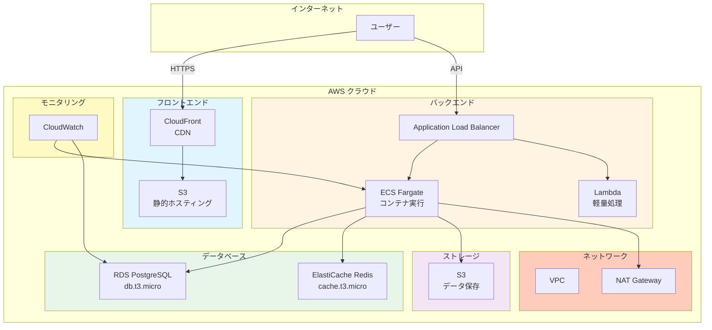
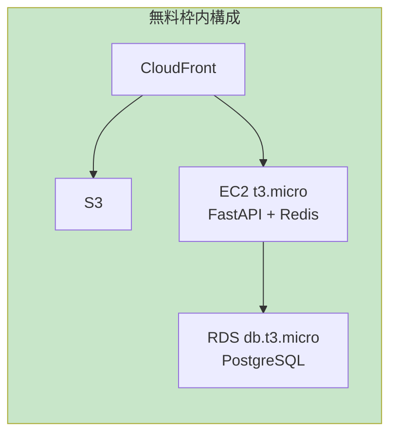
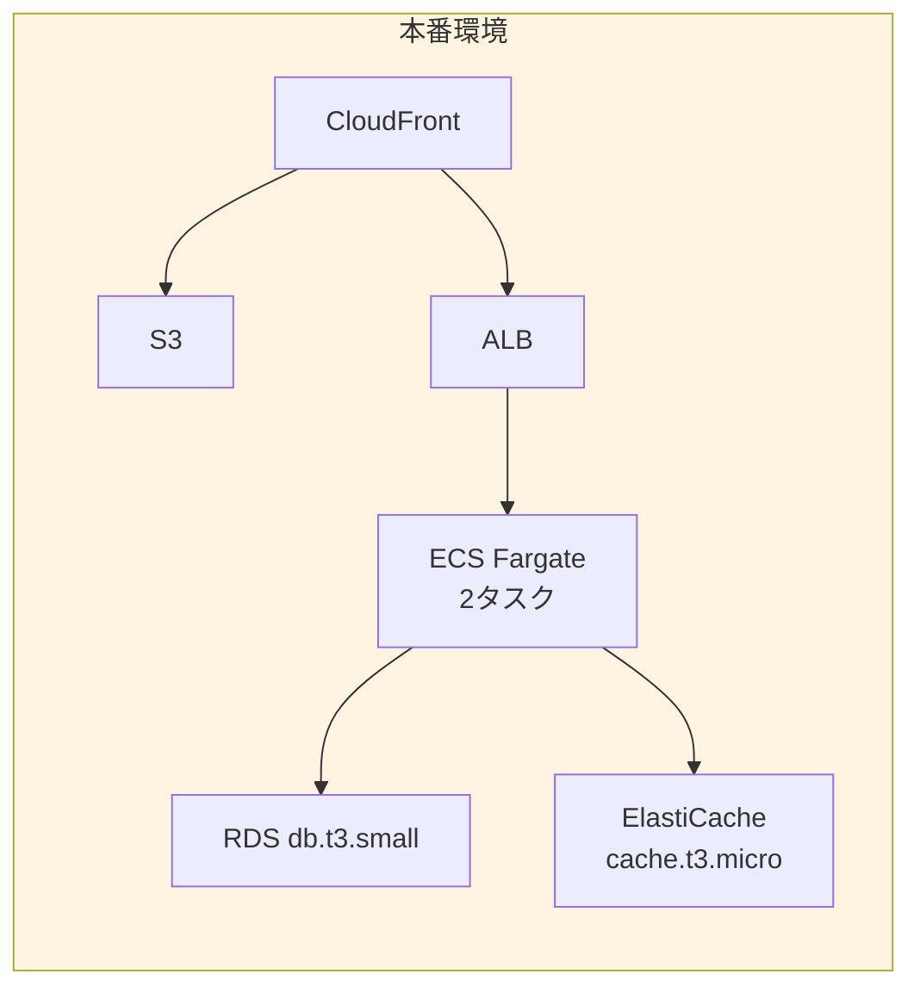

# AWS コスト見積もり書

## 1. システム構成

### 1.1 AWS構成図

## 2. AWS無料枠（Free Tier）の確認

### 2.1 12ヶ月間無料のサービス

| サービス | 無料枠 | 備考 |
|---------|--------|------|
| **EC2** | 750時間/月 (t2.micro/t3.micro) | 1インスタンス相当 |
| **RDS** | 750時間/月 (db.t2.micro/db.t3.micro) | PostgreSQL/MySQL/MariaDB |
| **S3** | 5GB ストレージ、20,000 GET、2,000 PUT | 標準ストレージ |
| **CloudFront** | 50GB データ転送、1,000,000 HTTP/HTTPSリクエスト | |
| **Lambda** | 1,000,000リクエスト/月、400,000 GB秒 | |
| **ElastiCache** | ❌ 無料枠なし | |
| **ECS Fargate** | ❌ 無料枠なし（EC2ベースはEC2無料枠適用） | |
| **ALB** | ❌ 無料枠なし | |
| **NAT Gateway** | ❌ 無料枠なし | |
| **CloudWatch** | 10メトリクス、5GBログ、100万APIリクエスト | |
| **VPC** | ✅ 無料 | |
| **データ転送** | 100GB/月（同一リージョン内） | |

### 2.2 常時無料のサービス

| サービス | 無料枠 | 備考 |
|---------|--------|------|
| **Lambda** | 常時無料枠あり（上記参照） | |
| **S3** | 常時無料枠あり（上記参照） | |
| **CloudWatch** | 常時無料枠あり（上記参照） | |

## 3. コスト見積もりシナリオ

### 3.0 個人利用向け構成（推奨）⭐

**想定利用状況:**
- ユーザー数: **1人（個人利用）**
- 1日あたりのAPIリクエスト: **10-50回**
- データベースサイズ: **100MB-500MB**
- 月間データ転送: **1-5GB**

**構成:**
- フロントエンド: S3 + CloudFront
- バックエンド: EC2 t3.micro（FastAPI + Redis同一インスタンス）
- データベース: RDS db.t3.micro
- ロードバランサー: なし
- NAT Gateway: なし（Public Subnet使用）

**月額コスト見積もり:**

| サービス | 仕様 | 無料枠 | 使用量 | 超過分 | 月額コスト |
|---------|------|--------|--------|--------|-----------|
| **EC2 t3.micro** | 1インスタンス、24時間稼働 | 750時間/月 | 730時間 | 0時間 | **$0** |
| **RDS db.t3.micro** | PostgreSQL、20GBストレージ | 750時間/月 | 730時間 | 0時間 | **$0** |
| **S3** | 1GBストレージ | 5GB | 1GB | 0GB | **$0** |
| **CloudFront** | 3GB転送/月 | 50GB | 3GB | 0GB | **$0** |
| **データ転送** | 3GB/月 | 100GB | 3GB | 0GB | **$0** |
| **CloudWatch** | 基本モニタリング | 無料枠内 | 基本のみ | - | **$0** |
| **合計** | | | | | **$0/月** |

**結論:** ✅ **完全に無料枠内で運用可能！個人利用には最適な構成です。**

**無料枠使用率:**
- EC2: 97% (730/750時間) - 余裕あり
- RDS: 97% (730/750時間) - 余裕あり
- S3: 20% (1/5GB) - 余裕あり
- CloudFront: 6% (3/50GB) - 余裕あり
- データ転送: 3% (3/100GB) - 余裕あり

---

### 3.1 シナリオ1: 最小構成（無料枠内で運用を目指す）

**想定利用状況:**
- ユーザー数: 10-50人
- 1日あたりのAPIリクエスト: 500-1,000回
- データベースサイズ: 1GB以下
- 月間データ転送: 10GB以下

**構成:**
- フロントエンド: S3 + CloudFront
- バックエンド: EC2 t3.micro (無料枠内)
- データベース: RDS db.t3.micro (無料枠内)
- キャッシュ: ElastiCache cache.t3.micro (無料枠外)
- ロードバランサー: なし（直接EC2にアクセス）

**月額コスト見積もり:**

| サービス | 仕様 | 無料枠 | 超過分 | 月額コスト |
|---------|------|--------|--------|-----------|
| **EC2 t3.micro** | 1インスタンス、24時間稼働 | 750時間/月 | 0時間 | **$0** |
| **RDS db.t3.micro** | PostgreSQL、20GBストレージ | 750時間/月 | 0時間 | **$0** |
| **ElastiCache cache.t3.micro** | Redis、0.5GB | 無料枠なし | - | **$15** |
| **S3** | 5GBストレージ | 5GB | 0GB | **$0** |
| **CloudFront** | 10GB転送 | 50GB | 0GB | **$0** |
| **データ転送** | 10GB/月 | 100GB | 0GB | **$0** |
| **CloudWatch** | 基本モニタリング | 無料枠内 | - | **$0** |
| **合計** | | | | **$15/月** |

**結論:** ほぼ無料枠内で運用可能。ElastiCacheのみ有料。

---

### 3.2 シナリオ2: 標準構成（小規模運用）

**想定利用状況:**
- ユーザー数: 100-500人
- 1日あたりのAPIリクエスト: 5,000-10,000回
- データベースサイズ: 10GB
- 月間データ転送: 50GB

**構成:**
- フロントエンド: S3 + CloudFront
- バックエンド: ECS Fargate (0.5 vCPU, 1GB RAM) × 2タスク
- データベース: RDS db.t3.small (無料枠超過)
- キャッシュ: ElastiCache cache.t3.micro
- ロードバランサー: ALB

**月額コスト見積もり:**

| サービス | 仕様 | 無料枠 | 超過分 | 月額コスト |
|---------|------|--------|--------|-----------|
| **ECS Fargate** | 0.5 vCPU, 1GB RAM × 2タスク | 無料枠なし | 730時間 × 2 | **$30** |
| **RDS db.t3.small** | PostgreSQL、20GBストレージ | 無料枠超過 | 730時間 | **$25** |
| **RDS ストレージ** | 20GB (GP3) | 20GB | 0GB | **$2.30** |
| **ElastiCache cache.t3.micro** | Redis、0.5GB | 無料枠なし | 730時間 | **$15** |
| **ALB** | Application Load Balancer | 無料枠なし | 730時間 | **$16** |
| **ALB LCU** | データ処理ユニット | 無料枠なし | 10GB/月 | **$2** |
| **S3** | 10GBストレージ | 5GB | 5GB | **$0.12** |
| **CloudFront** | 50GB転送 | 50GB | 0GB | **$0** |
| **データ転送** | 50GB/月 | 100GB | 0GB | **$0** |
| **NAT Gateway** | なし（PrivateLink使用） | - | - | **$0** |
| **CloudWatch** | ログ・メトリクス | 無料枠内 | - | **$0** |
| **合計** | | | | **$90.42/月** |

---

### 3.3 シナリオ3: 中規模構成（本格運用）

**想定利用状況:**
- ユーザー数: 1,000-5,000人
- 1日あたりのAPIリクエスト: 50,000-100,000回
- データベースサイズ: 50GB
- 月間データ転送: 200GB

**構成:**
- フロントエンド: S3 + CloudFront
- バックエンド: ECS Fargate (1 vCPU, 2GB RAM) × 3タスク
- データベース: RDS db.t3.medium (マルチAZ)
- キャッシュ: ElastiCache cache.t3.small
- ロードバランサー: ALB
- NAT Gateway: あり

**月額コスト見積もり:**

| サービス | 仕様 | 無料枠 | 超過分 | 月額コスト |
|---------|------|--------|--------|-----------|
| **ECS Fargate** | 1 vCPU, 2GB RAM × 3タスク | 無料枠なし | 730時間 × 3 | **$90** |
| **RDS db.t3.medium** | PostgreSQL、100GBストレージ、マルチAZ | 無料枠超過 | 730時間 × 2 | **$100** |
| **RDS ストレージ** | 100GB (GP3) | 100GB | 0GB | **$11.50** |
| **ElastiCache cache.t3.small** | Redis、1.5GB | 無料枠なし | 730時間 | **$30** |
| **ALB** | Application Load Balancer | 無料枠なし | 730時間 | **$16** |
| **ALB LCU** | データ処理ユニット | 無料枠なし | 200GB/月 | **$40** |
| **NAT Gateway** | NAT Gateway × 2 (マルチAZ) | 無料枠なし | 730時間 × 2 | **$65** |
| **NAT Gateway データ転送** | 200GB/月 | 無料枠なし | 200GB | **$18** |
| **S3** | 50GBストレージ | 5GB | 45GB | **$1.08** |
| **CloudFront** | 200GB転送 | 50GB | 150GB | **$12.75** |
| **データ転送** | 200GB/月 | 100GB | 100GB | **$9** |
| **CloudWatch** | ログ・メトリクス | 無料枠超過 | 10GBログ | **$5** |
| **合計** | | | | **$388.33/月** |

---

## 4. 無料枠内で運用するための最適化案

### 4.1 構成変更案

**変更点:**
1. **ElastiCacheの代替**: 
   - オプションA: EC2上でRedisを直接実行（EC2無料枠内）
   - オプションB: アプリケーションレベルのキャッシュ（メモリキャッシュ）
   - オプションC: DynamoDB（無料枠あり）をキャッシュとして使用

2. **ロードバランサーの削除**:
   - 直接EC2にアクセス（小規模運用の場合）
   - または Route 53 + Health Check を使用

3. **NAT Gatewayの削除**:
   - Public Subnetに配置（セキュリティグループで制御）
   - または VPC Endpoint を使用（S3/DynamoDBアクセス）

### 4.2 最適化後の最小構成（無料枠内）

**構成:**
- フロントエンド: S3 + CloudFront
- バックエンド: EC2 t3.micro（Redisも同じインスタンスで実行）
- データベース: RDS db.t3.micro
- ロードバランサー: なし
- NAT Gateway: なし（Public Subnet使用）

**月額コスト見積もり:**

| サービス | 仕様 | 無料枠 | 超過分 | 月額コスト |
|---------|------|--------|--------|-----------|
| **EC2 t3.micro** | 1インスタンス、Redis含む | 750時間/月 | 0時間 | **$0** |
| **RDS db.t3.micro** | PostgreSQL、20GBストレージ | 750時間/月 | 0時間 | **$0** |
| **S3** | 5GBストレージ | 5GB | 0GB | **$0** |
| **CloudFront** | 10GB転送 | 50GB | 0GB | **$0** |
| **データ転送** | 10GB/月 | 100GB | 0GB | **$0** |
| **CloudWatch** | 基本モニタリング | 無料枠内 | - | **$0** |
| **合計** | | | | **$0/月** |

**結論:** 完全に無料枠内で運用可能！

---

## 5. 推奨構成

### 5.1 開発・検証環境（無料枠内）

**月額コスト: $0**

### 5.2 本番環境（小規模）

**月額コスト: 約$90-100**

---

## 6. コスト削減のヒント

### 6.1 無料枠を最大限活用

1. **EC2 Spot インスタンス**: 最大90%割引（開発環境向け）
2. **RDS Reserved Instances**: 1年契約で最大40%割引
3. **S3 Intelligent-Tiering**: 自動的に低コストストレージクラスへ移動
4. **CloudFront**: キャッシュヒット率を上げて転送量を削減

### 6.2 アーキテクチャ最適化

1. **サーバーレス構成**: Lambda + API Gateway（無料枠あり）
2. **DynamoDB**: キャッシュとして使用（無料枠あり）
3. **Aurora Serverless**: 使用時のみ課金（小規模運用に最適）

### 6.3 モニタリングとアラート

- AWS Cost Explorerでコストを可視化
- CloudWatch Billing Alarmsで予算超過を通知
- タグ付けでリソースごとのコストを把握

---

## 7. まとめ

### 7.1 個人利用の場合

**✅ 完全に無料枠内で運用可能！**

個人利用であれば、**月額$0で運用可能**です。

**推奨構成:**
- EC2 t3.micro 1インスタンス（FastAPI + Redis同一インスタンス）
- RDS db.t3.micro 1インスタンス
- S3 + CloudFront（無料枠内）
- ロードバランサーなし
- NAT Gatewayなし

**無料枠使用率（個人利用想定）:**
- EC2: 約97% - 余裕あり
- RDS: 約97% - 余裕あり
- S3: 約20% - 余裕あり
- CloudFront: 約6% - 余裕あり
- データ転送: 約3% - 余裕あり

**結論:** 個人利用であれば、無料枠内で十分に運用可能です。12ヶ月間の無料枠期間後も、同じ構成で月額$15程度で運用可能です。

### 7.2 無料枠内で運用可能か？（複数ユーザー）

**✅ はい、可能です！**

最適化された構成であれば、**完全に無料枠内で運用可能**です。

**条件:**
- EC2 t3.micro 1インスタンス（Redisも同じインスタンス）
- RDS db.t3.micro 1インスタンス
- S3 + CloudFront（無料枠内）
- ロードバランサーなし
- NAT Gatewayなし

**想定ユーザー数:** 10-100人程度

### 7.2 コスト見積もりまとめ

| 構成 | 月額コスト | 想定ユーザー数 | 無料枠使用率 |
|------|-----------|--------------|------------|
| **個人利用（推奨）** ⭐ | **$0** | **1人** | 3-20% |
| **最小構成（最適化）** | **$0** | 10-100人 | 50-97% |
| **最小構成（標準）** | **$15** | 10-50人 | - |
| **標準構成** | **$90-100** | 100-500人 | - |
| **中規模構成** | **$380-400** | 1,000-5,000人 | - |

**個人利用の場合:** 無料枠内で余裕を持って運用可能。12ヶ月後も月額$0-15程度で運用継続可能。

### 7.3 推奨アプローチ

#### 個人利用の場合
1. **Phase 1（開発・検証）**: 無料枠内構成で開始
2. **Phase 2（本番運用）**: 同じ構成のまま運用継続
   - 12ヶ月間: **$0/月**
   - 12ヶ月後: **$15/月**（ElastiCache使用時）または **$0/月**（EC2上でRedis実行時）

#### 複数ユーザー向けの場合
1. **Phase 1（開発・検証）**: 無料枠内構成で開始
2. **Phase 2（小規模運用）**: ユーザー増加に応じて段階的に拡張
3. **Phase 3（本格運用）**: 標準構成へ移行

**注意:** AWS無料枠は新規アカウントのみ12ヶ月間有効です。個人利用の場合、12ヶ月後も最適化構成であれば月額$0-15程度で運用可能です。

