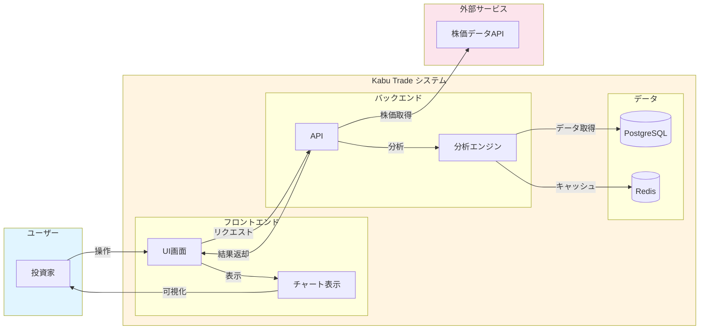
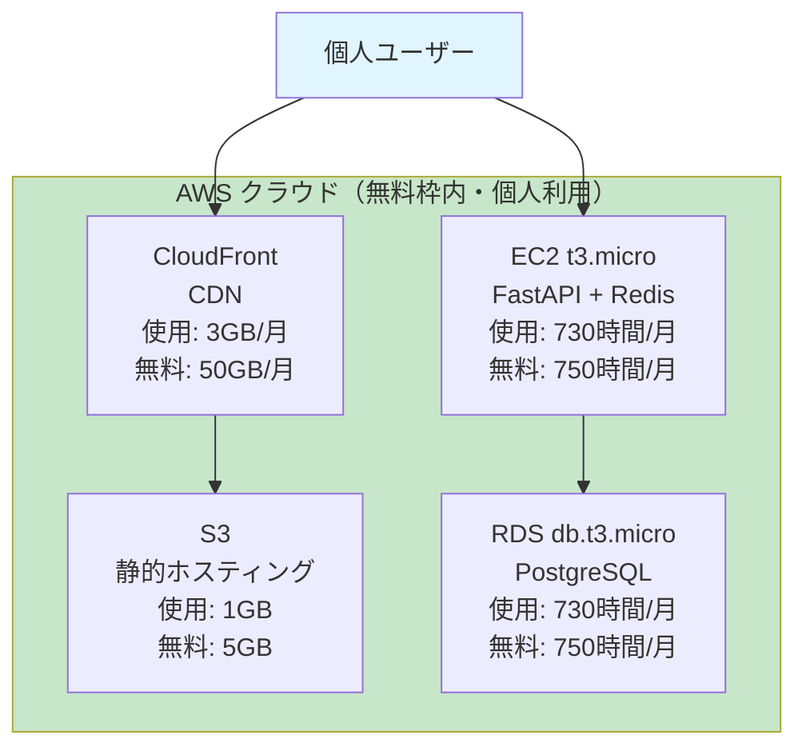

# 株取引支援システム (Kabu Trade)

株式投資を支援するシステムです。特定の株式の情報を取得し、投資判断を支援する機能を提供します。

## システム概要



## 機能概要

1. **株情報取得機能**
   - 銘柄コードまたは銘柄名で検索
   - 現在の株価、過去の株価推移、企業情報、財務情報を取得

2. **株評価機能（買い時・売り時判定）**
   - テクニカル分析（移動平均線、RSI、MACD等）
   - ファンダメンタル分析（PER、PBR、財務健全性等）
   - 買い時・売り時の判定と推奨度の表示

3. **投資方針登録機能**
   - 投資スタイルに応じた方針の登録・管理
   - 重視する指標の設定
   - 複数の投資方針を管理可能

4. **投資方針に基づく評価・見極めポイント機能**
   - 登録した投資方針に基づいて銘柄を評価
   - 買い時・売り時を見極めるポイントを提示
   - 投資方針との適合度をスコア化

## プロジェクト構成

```mermaid
graph TD
    Root[kabu-trade/]
    
    Root --> Docs[ドキュメント]
    Docs --> Req[requirements.md<br/>要件定義書]
    Docs --> Arch[ARCHITECTURE.md<br/>アーキテクチャ設計書]
    Docs --> AWS_Cost[AWS_COST_ESTIMATE.md<br/>AWSコスト見積もり]
    Docs --> AWS_Arch[AWS_ARCHITECTURE.md<br/>AWSアーキテクチャ]
    Docs --> Readme[README.md<br/>プロジェクト概要]
    
    Root --> Backend[backend/<br/>バックエンド]
    Backend --> API[app/api/<br/>APIルーティング]
    Backend --> Services[app/services/<br/>ビジネスロジック]
    Backend --> Repos[app/repositories/<br/>データアクセス]
    Backend --> Models[app/models/<br/>データモデル]
    
    Root --> Frontend[frontend/<br/>フロントエンド]
    Frontend --> Components[src/components/<br/>UIコンポーネント]
    Frontend --> Pages[src/pages/<br/>ページ]
    Frontend --> Store[src/store/<br/>状態管理]
    Frontend --> Services_FE[src/services/<br/>API通信]
    
    Root --> Infra[インフラ]
    Infra --> Docker[docker-compose.yml]
    Infra --> Config[設定ファイル]
    
    style Root fill:#e3f2fd
    style Docs fill:#fff3e0
    style Backend fill:#e8f5e9
    style Frontend fill:#f3e5f5
    style Infra fill:#fce4ec
```



```
kabu-trade/
├── requirements.md          # 要件定義書
├── ARCHITECTURE.md          # アーキテクチャ設計書
├── AWS_COST_ESTIMATE.md     # AWSコスト見積もり
├── AWS_ARCHITECTURE.md      # AWSアーキテクチャ設計
├── README.md                # プロジェクト概要
├── backend/                 # バックエンド（FastAPI）
├── frontend/                # フロントエンド（React）
└── docs/                    # 追加ドキュメント
```

## 技術スタック

- **バックエンド**: Python 3.11+, FastAPI
- **フロントエンド**: React + TypeScript
- **データベース**: PostgreSQL + Redis
- **データ分析**: pandas, numpy, ta-lib

## AWS デプロイメント

### コスト見積もり

このシステムは**AWS無料枠内で運用可能**です！

**個人利用向け構成（推奨）⭐:**
- EC2 t3.micro（FastAPI + Redis同一インスタンス）
- RDS db.t3.micro（PostgreSQL）
- S3 + CloudFront（フロントエンド）
- **月額コスト: $0（完全無料）**
- **無料枠使用率: 3-20%（余裕あり）**

**想定利用状況（個人利用）:**
- ユーザー数: 1人
- 1日あたりのAPIリクエスト: 10-50回
- データベースサイズ: 100-500MB
- 月間データ転送: 1-5GB

**12ヶ月後も:** 同じ構成で月額$0-15程度で運用継続可能

詳細は以下を参照してください：
- [AWS_COST_ESTIMATE.md](./AWS_COST_ESTIMATE.md) - コスト見積もり詳細
- [AWS_ARCHITECTURE.md](./AWS_ARCHITECTURE.md) - AWSアーキテクチャ設計

### AWS構成図（個人利用向け）



**月額コスト: $0（完全無料）**

## セットアップ

詳細なセットアップ手順は [SETUP.md](./SETUP.md) を参照してください。

### クイックスタート

1. **データベースの起動**
   ```bash
   docker-compose up -d postgres redis
   ```

2. **バックエンドのセットアップ**
   ```bash
   cd backend
   python -m venv venv
   source venv/bin/activate
   pip install -r requirements.txt
   cp .env.example .env  # .envファイルを編集
   alembic upgrade head
   uvicorn app.main:app --reload
   ```

3. **フロントエンドのセットアップ**
   ```bash
   cd frontend
   npm install
   npm run dev
   ```

4. **アクセス**
   - フロントエンド: http://localhost:5173
   - バックエンドAPI: http://localhost:8000
   - APIドキュメント: http://localhost:8000/docs

## ライセンス

未定

