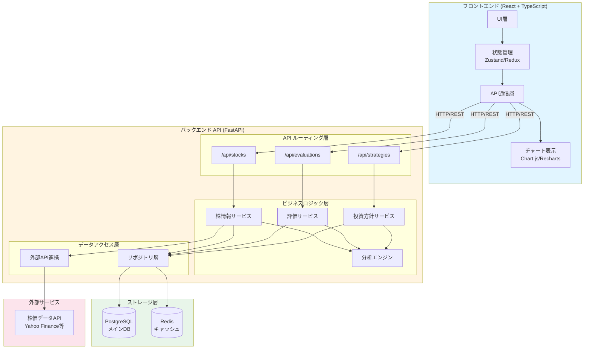
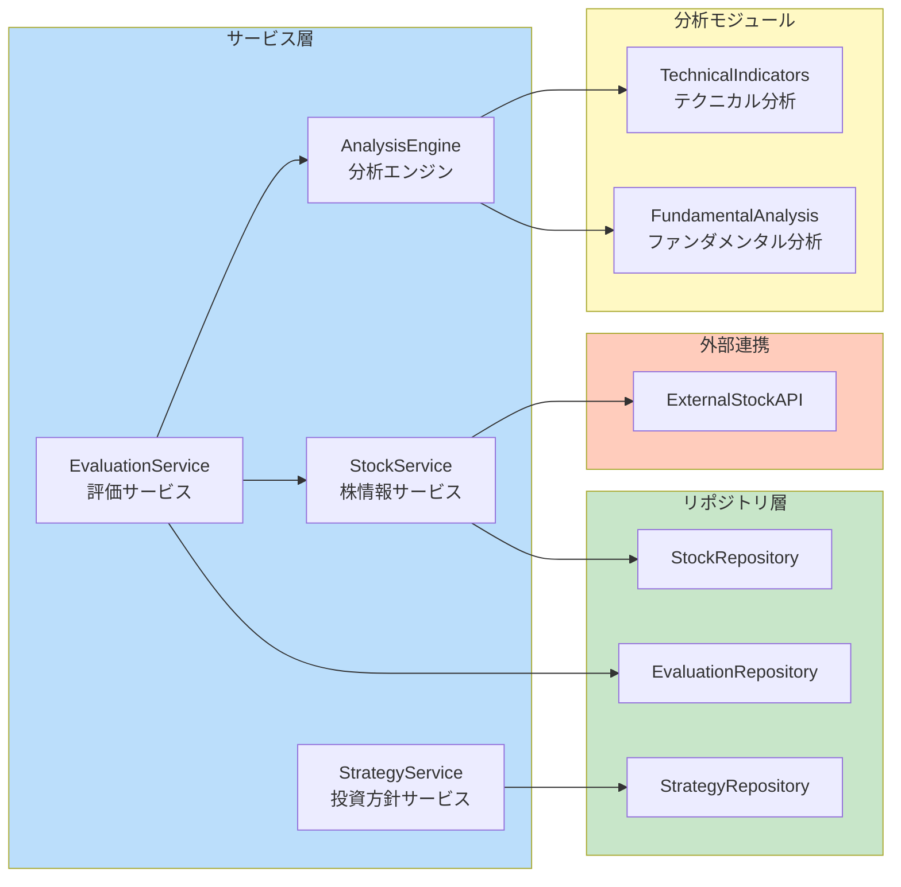
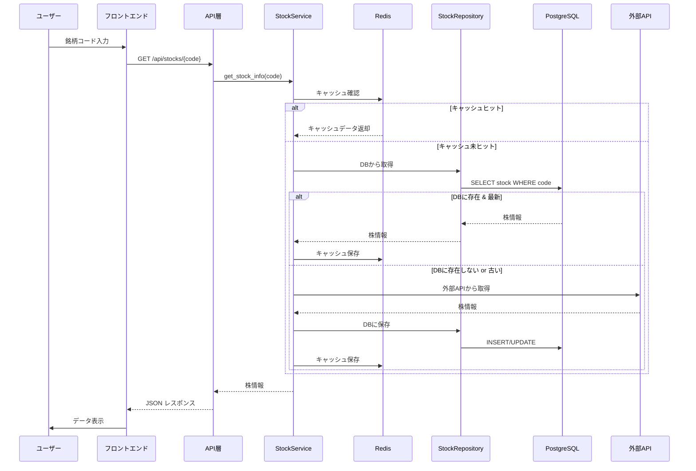
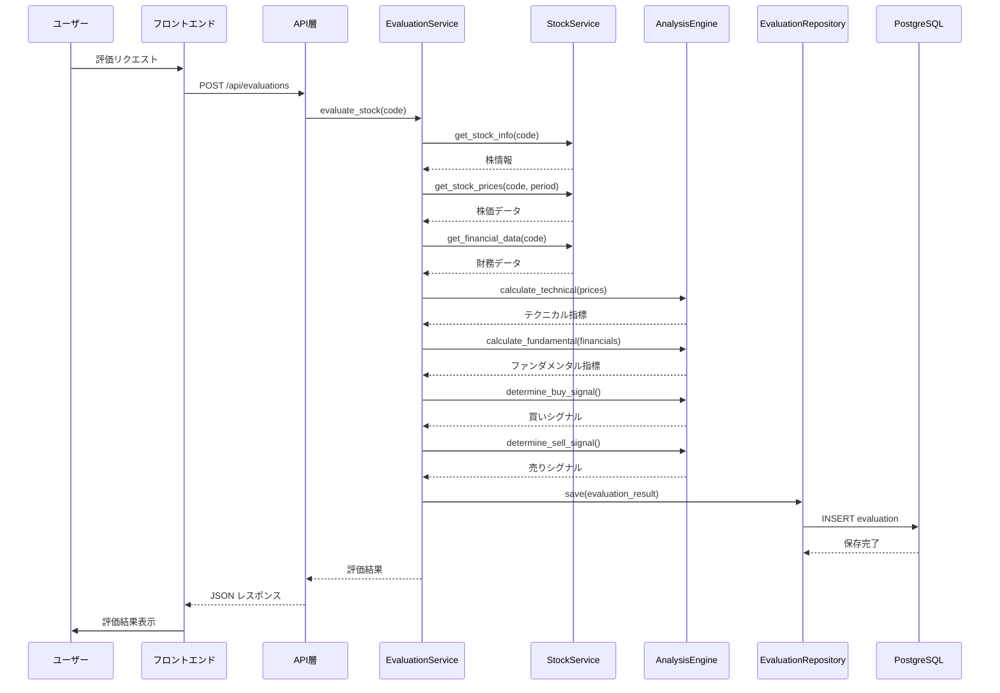
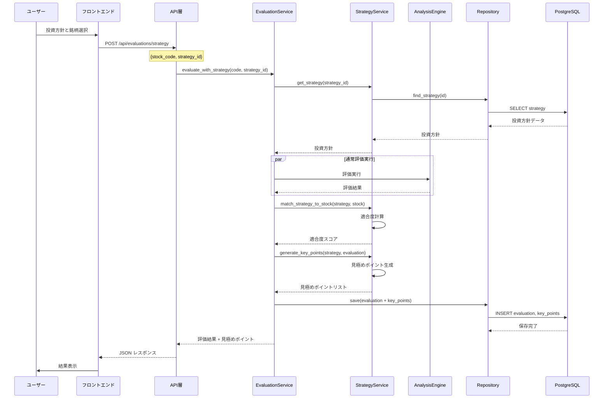
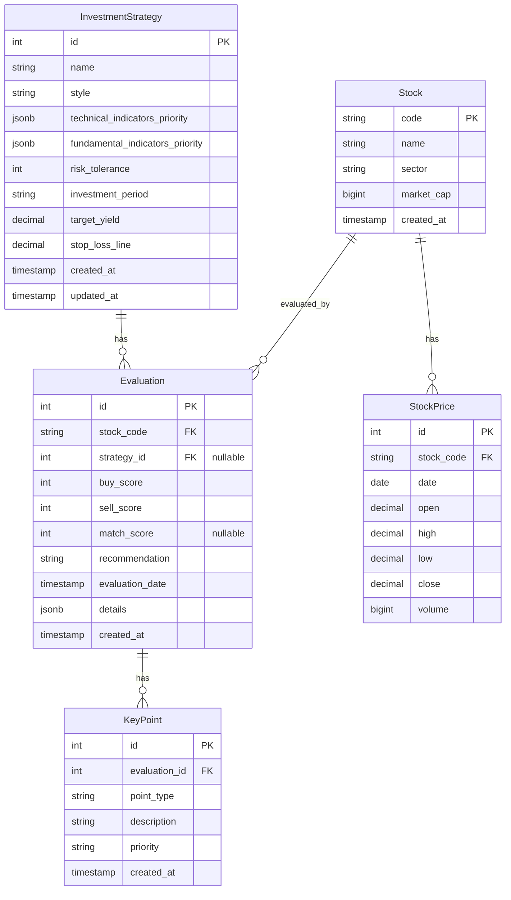

# 株取引支援システム 要件定義書

## 1. プロジェクト概要

### 1.1 目的
特定の株式の情報を取得し、投資判断を支援するシステムを構築する。投資方針を登録し、その方針に基づいて株式の評価と買い時・売り時の見極めポイントを提供する。

### 1.2 対象ユーザー
- **個人投資家（1名）**: 個人の投資効率化を目的とした利用
- 株式投資に興味のあるユーザー

### 1.3 利用前提
- **個人利用**: 1名での利用を想定
- **日本株に特化**: 東証・名証（名古屋証券取引所）対応を必須とする
- **世界株**: Phase 2以降で検討
- **データソース**: kabuステーションAPI（SBI証券）をメインに使用
- **リアルタイムデータ**: リアルタイム株価データの取得に対応

## 2. 機能要件

### 2.1 株情報取得機能
**機能ID**: FR-001

**概要**: 特定の株式銘柄の情報を取得する

**詳細要件**:
- 銘柄コード（例: 7203）または銘柄名で検索可能
- **対応市場**: 
  - 日本株: 東証（一部・二部・マザーズ・グロース）、名証（名古屋証券取引所）を必須とする
  - 世界株: Phase 2以降で検討
- 取得する情報:
  - **リアルタイム株価**: 現在の株価、板情報（買い気配・売り気配）
  - 過去の株価推移（日足、週足、月足、分足）
  - 企業情報（業種、時価総額、PER、PBR等）
  - 財務情報（売上高、利益、ROE等）
  - ニュース・決算情報
- **データソース**: 
  - メイン: kabuステーションAPI（SBI証券）からリアルタイムデータを取得
  - フォールバック: キャッシュからの取得（API障害時）
- 複数の銘柄を同時に管理可能

**入力**:
- 銘柄コードまたは銘柄名

**出力**:
- 株価情報
- 企業情報
- 財務データ
- チャートデータ

### 2.2 株評価機能（買い時・売り時判定）
**機能ID**: FR-002

**概要**: 取得した株情報を分析し、買い時・売り時を判定する

**詳細要件**:
- テクニカル分析:
  - 移動平均線（短期・中期・長期）
  - RSI（相対力指数）
  - MACD
  - ボリンジャーバンド
  - サポート・レジスタンスライン
- ファンダメンタル分析:
  - PER、PBRの評価
  - 業績推移の評価
  - 財務健全性の評価
- 買い時判定:
  - 複数の指標を総合的に評価
  - 買いシグナルの強度を数値化（例: 0-100点）
  - 買い推奨度の表示（強力/推奨/注意/非推奨）
- 売り時判定:
  - 利確・損切のタイミング判定
  - 売りシグナルの強度を数値化
  - 売り推奨度の表示
- 判定理由の説明を提供

**入力**:
- 銘柄コード
- 評価期間（オプション）

**出力**:
- 買い時判定結果（推奨度、スコア、理由）
- 売り時判定結果（推奨度、スコア、理由）
- テクニカル指標の値
- ファンダメンタル指標の値

### 2.3 投資方針登録機能
**機能ID**: FR-003

**概要**: ユーザーが投資方針を登録・管理する

**詳細要件**:
- 投資方針の登録:
  - 方針名（例: "成長株投資"、"バリュー投資"、"配当重視"）
  - 投資スタイルの選択
  - 重視する指標の設定:
    - テクニカル指標の優先度
    - ファンダメンタル指標の優先度
    - リスク許容度
  - 投資期間の設定（短期/中期/長期）
  - 目標利回り
  - 損切ラインの設定
- 投資方針の一覧表示
- 投資方針の編集・削除
- 複数の投資方針を登録可能

**入力**:
- 方針名
- 投資スタイル
- 各種設定値

**出力**:
- 登録された投資方針の一覧
- 投資方針の詳細情報

### 2.4 投資方針に基づく評価・見極めポイント機能
**機能ID**: FR-004

**概要**: 登録した投資方針に基づいて、特定の銘柄を評価し、見極めポイントを提示する

**詳細要件**:
- 投資方針と銘柄のマッチング評価:
  - 選択した投資方針に基づいて銘柄を評価
  - 方針との適合度をスコア化（例: 0-100点）
  - 適合/不適合の判定
- 見極めポイントの提示:
  - 買い時を見極めるポイント（例: "RSIが30を下回ったら買い"）
  - 売り時を見極めるポイント（例: "目標利回り10%に達したら利確"）
  - 注意すべきポイント（例: "PERが業界平均を大きく上回っている"）
- 投資方針別の推奨アクション:
  - 買い推奨/売り推奨/保持推奨/様子見
  - 推奨アクションの理由説明
- 銘柄と投資方針の組み合わせ履歴の保存
- 過去の評価結果との比較

**入力**:
- 銘柄コード
- 投資方針ID

**出力**:
- 投資方針との適合度スコア
- 見極めポイント（買い時/売り時/注意点）
- 推奨アクション
- 詳細な評価レポート

## 3. 非機能要件

### 3.1 パフォーマンス
- 株価情報の取得は5秒以内に完了すること
- 評価計算は3秒以内に完了すること
- UIの応答性を確保（操作に対する反応は1秒以内）

### 3.2 セキュリティ
- ユーザー認証機能（将来的な拡張）
- 個人情報の適切な管理
- APIキーの安全な管理

### 3.3 可用性
- 株価情報取得APIの障害時のエラーハンドリング
- データ取得失敗時のリトライ機能

### 3.4 拡張性
- 新しいテクニカル指標の追加が容易
- 新しい投資方針タイプの追加が容易
- 複数の株価情報提供元に対応可能な設計

## 4. データモデル（案）

### 4.1 投資方針（InvestmentStrategy）
- id: 一意ID
- name: 方針名
- style: 投資スタイル（成長株/バリュー/配当重視等）
- technical_indicators_priority: テクニカル指標の優先度設定
- fundamental_indicators_priority: ファンダメンタル指標の優先度設定
- risk_tolerance: リスク許容度（1-5）
- investment_period: 投資期間（短期/中期/長期）
- target_yield: 目標利回り（%）
- stop_loss_line: 損切ライン（%）
- created_at: 作成日時
- updated_at: 更新日時

### 4.2 銘柄（Stock）
- code: 銘柄コード
- name: 銘柄名
- sector: 業種
- market_cap: 時価総額
- created_at: 作成日時

### 4.3 株価データ（StockPrice）
- id: 一意ID
- stock_code: 銘柄コード
- date: 日付
- open: 始値
- high: 高値
- low: 安値
- close: 終値
- volume: 出来高

### 4.4 評価結果（Evaluation）
- id: 一意ID
- stock_code: 銘柄コード
- strategy_id: 投資方針ID
- buy_score: 買いスコア（0-100）
- sell_score: 売りスコア（0-100）
- match_score: 投資方針との適合度（0-100）
- recommendation: 推奨アクション（買い/売り/保持/様子見）
- evaluation_date: 評価日時
- details: 評価詳細（JSON）

### 4.5 見極めポイント（KeyPoint）
- id: 一意ID
- evaluation_id: 評価結果ID
- point_type: ポイントタイプ（買い時/売り時/注意点）
- description: 説明
- priority: 優先度（高/中/低）

## 5. システムアーキテクチャ

### 5.1 全体構成



### 5.2 レイヤーアーキテクチャ

#### 5.2.1 フロントエンド構成

```
Frontend/
├── src/
│   ├── components/          # UIコンポーネント
│   │   ├── common/          # 共通コンポーネント
│   │   ├── stock/           # 株情報関連
│   │   ├── evaluation/      # 評価関連
│   │   └── strategy/        # 投資方針関連
│   ├── pages/               # ページコンポーネント
│   ├── hooks/               # カスタムフック
│   ├── services/            # API通信層
│   ├── store/               # 状態管理
│   ├── types/               # TypeScript型定義
│   └── utils/               # ユーティリティ
```

#### 5.2.2 バックエンド構成

```
Backend/
├── app/
│   ├── api/                 # APIルーティング
│   │   ├── v1/
│   │   │   ├── stocks.py
│   │   │   ├── evaluations.py
│   │   │   └── strategies.py
│   ├── core/                # コア設定
│   │   ├── config.py
│   │   └── security.py
│   ├── services/            # ビジネスロジック層
│   │   ├── stock_service.py
│   │   ├── evaluation_service.py
│   │   ├── strategy_service.py
│   │   └── analysis_engine.py
│   ├── repositories/        # データアクセス層
│   │   ├── stock_repository.py
│   │   ├── evaluation_repository.py
│   │   └── strategy_repository.py
│   ├── models/              # データモデル
│   │   ├── stock.py
│   │   ├── evaluation.py
│   │   └── strategy.py
│   ├── schemas/             # Pydanticスキーマ
│   ├── external/            # 外部API連携
│   │   ├── stock_api_client.py
│   │   └── data_provider.py
│   └── utils/               # ユーティリティ
│       ├── technical_indicators.py
│       └── fundamental_analysis.py
├── tests/                   # テスト
└── alembic/                 # DBマイグレーション
```

### 5.3 コンポーネント設計



#### 5.3.1 株情報サービス (StockService)
- **責務**: 株情報の取得・管理
- **依存**: StockRepository, ExternalStockAPI
- **主要メソッド**:
  - `get_stock_info(code: str) -> StockInfo`
  - `get_stock_prices(code: str, period: str) -> List[StockPrice]`
  - `get_financial_data(code: str) -> FinancialData`
  - `search_stocks(query: str) -> List[Stock]`

#### 5.3.2 評価サービス (EvaluationService)
- **責務**: 株の評価・分析
- **依存**: StockService, AnalysisEngine, EvaluationRepository
- **主要メソッド**:
  - `evaluate_stock(code: str) -> EvaluationResult`
  - `evaluate_with_strategy(code: str, strategy_id: int) -> StrategyEvaluationResult`
  - `get_key_points(evaluation_id: int) -> List[KeyPoint]`

#### 5.3.3 分析エンジン (AnalysisEngine)
- **責務**: テクニカル・ファンダメンタル分析の実行
- **依存**: TechnicalIndicators, FundamentalAnalysis
- **主要メソッド**:
  - `calculate_technical_indicators(prices: List[StockPrice]) -> TechnicalIndicators`
  - `calculate_fundamental_metrics(financial_data: FinancialData) -> FundamentalMetrics`
  - `determine_buy_signal(indicators: TechnicalIndicators) -> BuySignal`
  - `determine_sell_signal(indicators: TechnicalIndicators) -> SellSignal`

#### 5.3.4 投資方針サービス (StrategyService)
- **責務**: 投資方針の管理・評価
- **依存**: StrategyRepository
- **主要メソッド**:
  - `create_strategy(strategy_data: StrategyCreate) -> Strategy`
  - `update_strategy(strategy_id: int, strategy_data: StrategyUpdate) -> Strategy`
  - `match_strategy_to_stock(strategy_id: int, stock_code: str) -> MatchScore`
  - `generate_key_points(strategy: Strategy, evaluation: EvaluationResult) -> List[KeyPoint]`

### 5.4 データフロー

#### 5.4.1 株情報取得フロー



#### 5.4.2 評価実行フロー



#### 5.4.3 投資方針に基づく評価フロー



### 5.5 データベース設計

#### 5.5.1 テーブル関係図



#### 5.5.2 インデックス設計
- `Stock.code`: PRIMARY KEY
- `StockPrice.stock_code, date`: 複合インデックス
- `Evaluation.stock_code, evaluation_date`: 複合インデックス
- `Evaluation.strategy_id`: インデックス
- `InvestmentStrategy.id`: PRIMARY KEY

### 5.6 キャッシュ戦略

#### 5.6.1 Redisキャッシュ
- **リアルタイム株価データ**: TTL 1-5分（市場時間中は短め、市場外は長め）
  - kabuステーションAPIのレート制限対策
  - リアルタイム性とAPI呼び出し回数のバランス
- **過去の株価データ（日足等）**: TTL 1時間（市場時間中）、24時間（市場外）
- **企業情報**: TTL 1時間
- **財務情報**: TTL 24時間
- **評価結果**: TTL 10分（同一銘柄・同一方針の重複評価を防ぐ）
- **マスター情報（銘柄一覧等）**: TTL 24時間

#### 5.6.2 キャッシュキー設計
- `stock:{code}:info` - 企業情報
- `stock:{code}:prices:{period}` - 株価データ
- `stock:{code}:financials` - 財務情報
- `evaluation:{code}:{strategy_id}` - 評価結果

### 5.7 外部API連携

#### 5.7.1 株価データプロバイダー抽象化
```python
class StockDataProvider(ABC):
    @abstractmethod
    def get_stock_info(self, code: str) -> StockInfo:
        pass
    
    @abstractmethod
    def get_stock_prices(self, code: str, period: str) -> List[StockPrice]:
        pass
```

- **実装クラス**:
  - `KabuStationProvider`: kabuステーションAPI使用（**Phase 1 - 最初の実装**）
    - SBI証券のkabuステーションAPI
    - リアルタイム株価データ対応
    - 日本株（東証・名証）対応
    - 無料（SBI証券口座開設済み前提）
  - `YahooFinanceProvider`: yfinance使用（フォールバック用・将来の拡張）
  - `RakutenProvider`: 楽天証券API使用（将来の拡張）

#### 5.7.2 フォールバック戦略

**Phase 1の実装:**
1. **プライマリ**: kabuステーションAPIから取得を試行
2. **セカンダリ**: キャッシュ（Redis）から取得（API障害時、レート制限超過時）
3. **最終**: エラーを返す

**将来の拡張（Phase 2以降）:**
1. プライマリプロバイダー（kabuステーションAPI）から取得を試行
2. 失敗時はセカンダリプロバイダー（yfinance等）に切り替え
3. 全て失敗時はキャッシュから取得（可能な場合）
4. 最終的にエラーを返す

#### 5.7.3 kabuステーションAPI仕様

**認証:**
- API Token認証が必要
- 環境変数で管理（`.env`ファイル）
- 認証情報: `KABU_STATION_API_TOKEN`, `KABU_STATION_PASSWORD`

**取得可能なデータ:**
- リアルタイム株価・板情報
- 過去の株価データ（日足、週足、月足、分足）
- 企業情報・財務情報
- ニュース・決算情報
- マスター情報

**レート制限:**
- API呼び出し回数に制限あり
- キャッシュ戦略でレート制限を回避
- レート制限超過時はキャッシュから返却

**対応市場:**
- 東証（一部・二部・マザーズ・グロース）
- 名証（名古屋証券取引所）
- その他地方証券取引所

**エラーハンドリング:**
- 市場休場時の適切な処理
- API障害時の自動フォールバック
- レート制限超過時の適切な対応

### 5.8 エラーハンドリング

#### 5.8.1 エラーレスポンス形式
```json
{
  "error": {
    "code": "STOCK_NOT_FOUND",
    "message": "指定された銘柄が見つかりません",
    "details": {}
  }
}
```

#### 5.8.2 エラーコード
- `STOCK_NOT_FOUND`: 銘柄が見つからない
- `EXTERNAL_API_ERROR`: 外部APIエラー
- `EVALUATION_FAILED`: 評価処理失敗
- `STRATEGY_NOT_FOUND`: 投資方針が見つからない
- `VALIDATION_ERROR`: バリデーションエラー

### 5.9 セキュリティ設計

#### 5.9.1 API認証
- **外部API認証**: kabuステーションAPI Token認証（Phase 1）
  - 環境変数による認証情報管理
  - `.env`ファイルで管理（Gitにコミットしない）
  - API Token、パスワードの安全な管理
- **ユーザー認証**: JWT認証（将来実装）
- **レート制限**: 
  - kabuステーションAPIのレート制限に準拠
  - アプリケーションレベルでのレート制限実装（1分あたり100リクエスト等）

#### 5.9.2 データ保護
- 環境変数による機密情報管理
- HTTPS通信の強制
- SQLインジェクション対策（ORM使用）
- XSS対策（フロントエンド）

## 6. 技術スタック（提案）

### 6.1 バックエンド
- **言語**: Python 3.11+
- **フレームワーク**: FastAPI（RESTful API構築）
- **ORM**: SQLAlchemy
- **マイグレーション**: Alembic
- **データベース**: PostgreSQL（リレーショナルデータ） + Redis（キャッシュ）
- **株価データ取得**: 
  - **メイン**: kabuステーションAPI（SBI証券）- Phase 1実装
    - リアルタイム株価データ対応
    - 日本株（東証・名証）対応
    - 無料（SBI証券口座開設済み前提）
  - **フォールバック**: yfinance（Yahoo Finance API）- Phase 2以降で検討
  - **将来の拡張**: 楽天証券API等
- **データ分析**: 
  - pandas（データ処理）
  - numpy（数値計算）
  - ta-libまたはpandas_ta（テクニカル分析）
- **バリデーション**: Pydantic
- **テスト**: pytest, pytest-asyncio

### 6.2 フロントエンド
- **フレームワーク**: React 18+ + TypeScript
- **UIライブラリ**: Material-UI または Tailwind CSS
- **チャート**: Chart.js または Recharts
- **状態管理**: Zustand（軽量）または Redux Toolkit
- **API通信**: axios または fetch
- **ルーティング**: React Router
- **ビルドツール**: Vite
- **テスト**: Vitest, React Testing Library

### 6.3 インフラ
- **コンテナ**: Docker + Docker Compose
- **リバースプロキシ**: Nginx（本番環境）
- **CI/CD**: GitHub Actions（将来的）
- **モニタリング**: （将来的）Prometheus + Grafana

## 6. API設計（案）

### 6.1 株情報取得
- `GET /api/stocks/{code}` - 銘柄情報取得
- `GET /api/stocks/{code}/prices` - 株価データ取得
- `GET /api/stocks/{code}/financials` - 財務情報取得

### 6.2 評価機能
- `POST /api/evaluations` - 銘柄の評価実行
- `GET /api/evaluations/{id}` - 評価結果取得
- `GET /api/evaluations` - 評価履歴一覧

### 6.3 投資方針
- `GET /api/strategies` - 投資方針一覧取得
- `POST /api/strategies` - 投資方針登録
- `GET /api/strategies/{id}` - 投資方針詳細取得
- `PUT /api/strategies/{id}` - 投資方針更新
- `DELETE /api/strategies/{id}` - 投資方針削除

### 6.4 投資方針に基づく評価
- `POST /api/evaluations/strategy` - 投資方針に基づく評価実行
  - Body: `{ stock_code: string, strategy_id: number }`
- `GET /api/evaluations/strategy/{evaluation_id}/keypoints` - 見極めポイント取得

## 7. 実装フェーズ

### Phase 1: 株価情報取得・チャート表示機能（MVP）

**目標**: 外部APIから株価情報を取得し、チャート表示まで実現する

#### Phase 1.1: 基盤構築
- **プロジェクトセットアップ**
  - バックエンド（FastAPI）プロジェクトの初期化
  - フロントエンド（React + TypeScript）プロジェクトの初期化
  - Docker Compose環境の構築（開発環境）
  - 依存関係の定義（requirements.txt, package.json等）
- **データベース設計・構築**
  - PostgreSQLデータベースの設計
  - 基本的なテーブル定義（Stock, StockPrice等）
  - Alembicマイグレーション設定
  - Redis設定（キャッシュ用）
- **基本的なAPI構造の実装**
  - FastAPIの基本ルーティング設定
  - CORS設定
  - エラーハンドリングの基本実装
  - ロギング設定

#### Phase 1.2: kabuステーションAPI連携（バックエンド）
- **API認証・接続**
  - API Token取得・設定
  - 認証処理の実装
  - 接続テスト
- **プロバイダーパターンの実装**
  - `StockDataProvider`抽象クラスの定義
  - `KabuStationProvider`クラスの実装
- **株価データ取得機能の実装**
  - リアルタイム株価データ取得機能
  - 過去データ取得機能（日足、週足、月足）
  - 企業情報取得機能（基本情報）
  - 名証（名古屋証券取引所）対応の確認・実装
- **データアクセス層の実装**
  - `StockRepository`の実装
  - データ取得・保存機能
  - データベースへの永続化

#### Phase 1.3: バックエンドAPI実装
- **株価情報取得APIの実装**
  - `GET /api/stocks/{code}` - 銘柄情報取得
  - `GET /api/stocks/{code}/prices` - 株価データ取得（期間指定可）
- **キャッシュ戦略の実装**
  - Redisキャッシュの実装
  - キャッシュキーの設計
  - TTL設定（リアルタイムデータ: 1-5分、過去データ: 1時間等）
- **エラーハンドリング・フォールバック機能**
  - kabuステーションAPIエラーハンドリング
  - レート制限対策
  - キャッシュからのフォールバック機能
  - 市場休場時の処理

#### Phase 1.4: フロントエンド基本実装
- **プロジェクト構成**
  - React + TypeScript + Viteのセットアップ
  - ルーティング設定（React Router）
  - 状態管理の設定（Zustand）
  - API通信層の実装（axios/fetch）
- **基本UIコンポーネント**
  - レイアウトコンポーネント
  - 共通コンポーネント（Button, Card, Loading等）
  - エラー表示コンポーネント
- **銘柄検索・表示機能**
  - 銘柄コード入力フォーム
  - 銘柄情報表示コンポーネント
  - 株価データ一覧表示

#### Phase 1.5: チャート表示機能
- **チャートライブラリの統合**
  - Chart.js または Rechartsの導入
  - チャートコンポーネントの実装
- **チャート表示機能**
  - 株価チャートの表示（折れ線グラフ）
  - 期間選択機能（日足、週足、月足）
  - 基本的なインタラクション（ズーム、パン等）
- **リアルタイム更新機能**
  - WebSocketまたはポーリングによるリアルタイム更新
  - チャートの自動更新

#### Phase 1.6: 統合・テスト
- **統合テスト**
  - バックエンドとフロントエンドの統合
  - エンドツーエンドの動作確認
- **動作確認項目**
  - 銘柄コード入力 → 株価データ取得 → チャート表示の一連の流れ
  - 複数銘柄の切り替え表示
  - エラーハンドリングの確認
- **ドキュメント整備**
  - API仕様書の作成
  - セットアップ手順書の作成

### Phase 2: 評価機能
- テクニカル分析の実装
- ファンダメンタル分析の実装
- 買い時・売り時判定ロジックの実装
- 評価結果の表示機能

### Phase 3: 投資方針機能
- 投資方針のCRUD機能
- 投資方針に基づく評価機能
- 見極めポイント生成機能
- 投資方針管理UI

### Phase 4以降: 拡張機能
- **フォールバックプロバイダー**: yfinance等の実装
- **世界株対応**: 米国株、欧州株等の対応
- **ユーザー認証機能**: 複数ユーザー対応（個人利用では不要だが、将来の拡張）
- **その他拡張機能**
  - ポートフォリオ管理機能
  - アラート・通知機能
  - バックテスト機能
  - 機械学習による予測機能
  - モバイルアプリ対応

## 8. 今後の検討事項

### Phase 2以降で検討
- **世界株対応**: 米国株、欧州株等の対応
  - データソース: yfinance、Alpha Vantage等の検討
- **フォールバックプロバイダー**: yfinance等の実装
  - kabuステーションAPI障害時の代替手段

### 将来の拡張機能
- ユーザー認証・認可機能（複数ユーザー対応）
- ポートフォリオ管理機能
- アラート・通知機能（価格アラート等）
- バックテスト機能
- 機械学習による予測機能
- モバイルアプリ対応

### 個人利用向けの最適化
- ローカル開発環境の構築（Docker Compose）
- AWS無料枠内での運用（月額$0）
- 個人利用に最適化されたUI/UX
